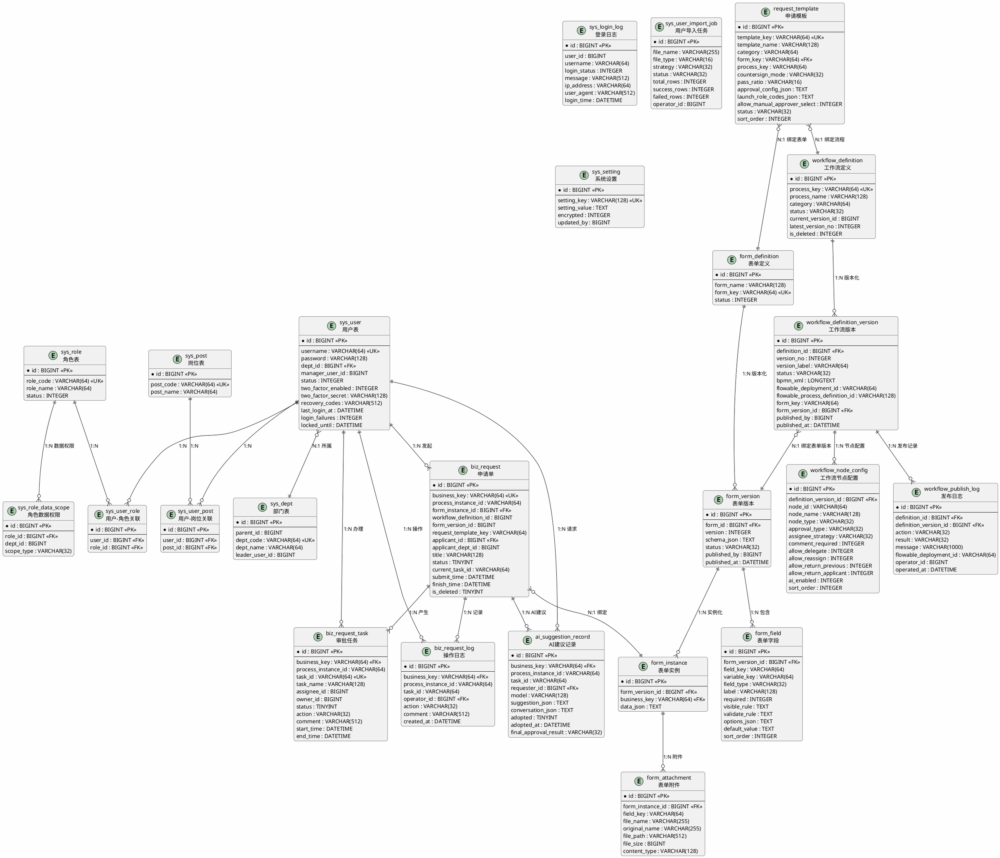
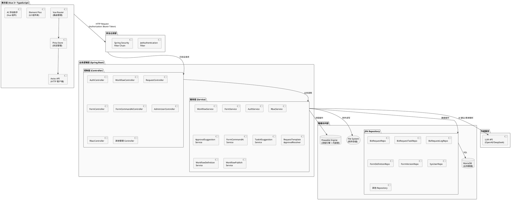

# E-R 图与架构图 (PlantUML)

## 1. 系统 E-R 图（核心实体关系）

```plantuml
@startuml 系统ER图
skinparam backgroundColor #FEFEFE
skinparam roundCorner 10

entity "sys_user\n用户表" as user {
  * id : BIGINT <<PK>>
  --
  username : VARCHAR(64) <<UK>>
  password : VARCHAR(128)
  dept_id : BIGINT <<FK>>
  manager_user_id : BIGINT
  status : INTEGER
  two_factor_enabled : INTEGER
  two_factor_secret : VARCHAR(128)
  recovery_codes : VARCHAR(512)
  last_login_at : DATETIME
  login_failures : INTEGER
  locked_until : DATETIME
}

entity "sys_role\n角色表" as role {
  * id : BIGINT <<PK>>
  --
  role_code : VARCHAR(64) <<UK>>
  role_name : VARCHAR(64)
  status : INTEGER
}

entity "sys_dept\n部门表" as dept {
  * id : BIGINT <<PK>>
  --
  parent_id : BIGINT
  dept_code : VARCHAR(64) <<UK>>
  dept_name : VARCHAR(64)
  leader_user_id : BIGINT
}

entity "sys_post\n岗位表" as post {
  * id : BIGINT <<PK>>
  --
  post_code : VARCHAR(64) <<UK>>
  post_name : VARCHAR(64)
}

entity "sys_user_role\n用户-角色关联" as ur {
  * id : BIGINT <<PK>>
  --
  user_id : BIGINT <<FK>>
  role_id : BIGINT <<FK>>
}

entity "sys_user_post\n用户-岗位关联" as up {
  * id : BIGINT <<PK>>
  --
  user_id : BIGINT <<FK>>
  post_id : BIGINT <<FK>>
}

entity "sys_role_data_scope\n角色数据权限" as rds {
  * id : BIGINT <<PK>>
  --
  role_id : BIGINT <<FK>>
  dept_id : BIGINT
  scope_type : VARCHAR(32)
}

entity "sys_login_log\n登录日志" as sll {
  * id : BIGINT <<PK>>
  --
  user_id : BIGINT
  username : VARCHAR(64)
  login_status : INTEGER
  message : VARCHAR(512)
  ip_address : VARCHAR(64)
  user_agent : VARCHAR(512)
  login_time : DATETIME
}

entity "sys_user_import_job\n用户导入任务" as suij {
  * id : BIGINT <<PK>>
  --
  file_name : VARCHAR(255)
  file_type : VARCHAR(16)
  strategy : VARCHAR(32)
  status : VARCHAR(32)
  total_rows : INTEGER
  success_rows : INTEGER
  failed_rows : INTEGER
  operator_id : BIGINT
}

entity "biz_request\n申请单" as br {
  * id : BIGINT <<PK>>
  --
  business_key : VARCHAR(64) <<UK>>
  process_instance_id : VARCHAR(64)
  form_instance_id : BIGINT <<FK>>
  workflow_definition_id : BIGINT
  form_version_id : BIGINT
  request_template_key : VARCHAR(64)
  applicant_id : BIGINT <<FK>>
  applicant_dept_id : BIGINT
  title : VARCHAR(128)
  status : TINYINT
  current_task_id : VARCHAR(64)
  submit_time : DATETIME
  finish_time : DATETIME
  is_deleted : TINYINT
}

entity "biz_request_task\n审批任务" as brt {
  * id : BIGINT <<PK>>
  --
  business_key : VARCHAR(64) <<FK>>
  process_instance_id : VARCHAR(64)
  task_id : VARCHAR(64) <<UK>>
  task_name : VARCHAR(128)
  assignee_id : BIGINT
  owner_id : BIGINT
  status : TINYINT
  action : VARCHAR(32)
  comment : VARCHAR(512)
  start_time : DATETIME
  end_time : DATETIME
}

entity "biz_request_log\n操作日志" as brl {
  * id : BIGINT <<PK>>
  --
  business_key : VARCHAR(64) <<FK>>
  process_instance_id : VARCHAR(64)
  task_id : VARCHAR(64)
  operator_id : BIGINT <<FK>>
  action : VARCHAR(32)
  comment : VARCHAR(512)
  created_at : DATETIME
}

entity "ai_suggestion_record\nAI建议记录" as aisr {
  * id : BIGINT <<PK>>
  --
  business_key : VARCHAR(64) <<FK>>
  process_instance_id : VARCHAR(64)
  task_id : VARCHAR(64)
  requester_id : BIGINT <<FK>>
  model : VARCHAR(128)
  suggestion_json : TEXT
  conversation_json : TEXT
  adopted : TINYINT
  adopted_at : DATETIME
  final_approval_result : VARCHAR(32)
}

entity "form_definition\n表单定义" as fd {
  * id : BIGINT <<PK>>
  --
  form_name : VARCHAR(128)
  form_key : VARCHAR(64) <<UK>>
  status : INTEGER
}

entity "form_version\n表单版本" as fv {
  * id : BIGINT <<PK>>
  --
  form_id : BIGINT <<FK>>
  version : INTEGER
  schema_json : TEXT
  status : VARCHAR(32)
  published_by : BIGINT
  published_at : DATETIME
}

entity "form_field\n表单字段" as ff {
  * id : BIGINT <<PK>>
  --
  form_version_id : BIGINT <<FK>>
  field_key : VARCHAR(64)
  variable_key : VARCHAR(64)
  field_type : VARCHAR(32)
  label : VARCHAR(128)
  required : INTEGER
  visible_rule : TEXT
  validate_rule : TEXT
  options_json : TEXT
  default_value : TEXT
  sort_order : INTEGER
}

entity "form_instance\n表单实例" as fi {
  * id : BIGINT <<PK>>
  --
  form_version_id : BIGINT <<FK>>
  business_key : VARCHAR(64) <<FK>>
  data_json : TEXT
}

entity "form_attachment\n表单附件" as fa {
  * id : BIGINT <<PK>>
  --
  form_instance_id : BIGINT <<FK>>
  field_key : VARCHAR(64)
  file_name : VARCHAR(255)
  original_name : VARCHAR(255)
  file_path : VARCHAR(512)
  file_size : BIGINT
  content_type : VARCHAR(128)
}

entity "workflow_definition\n工作流定义" as wd {
  * id : BIGINT <<PK>>
  --
  process_key : VARCHAR(64) <<UK>>
  process_name : VARCHAR(128)
  category : VARCHAR(64)
  status : VARCHAR(32)
  current_version_id : BIGINT
  latest_version_no : INTEGER
  is_deleted : INTEGER
}

entity "workflow_definition_version\n工作流版本" as wdv {
  * id : BIGINT <<PK>>
  --
  definition_id : BIGINT <<FK>>
  version_no : INTEGER
  version_label : VARCHAR(64)
  status : VARCHAR(32)
  bpmn_xml : LONGTEXT
  flowable_deployment_id : VARCHAR(64)
  flowable_process_definition_id : VARCHAR(128)
  form_key : VARCHAR(64)
  form_version_id : BIGINT <<FK>>
  published_by : BIGINT
  published_at : DATETIME
}

entity "workflow_node_config\n工作流节点配置" as wnc {
  * id : BIGINT <<PK>>
  --
  definition_version_id : BIGINT <<FK>>
  node_id : VARCHAR(64)
  node_name : VARCHAR(128)
  node_type : VARCHAR(32)
  approval_type : VARCHAR(32)
  assignee_strategy : VARCHAR(32)
  comment_required : INTEGER
  allow_delegate : INTEGER
  allow_reassign : INTEGER
  allow_return_previous : INTEGER
  allow_return_applicant : INTEGER
  ai_enabled : INTEGER
  sort_order : INTEGER
}

entity "workflow_publish_log\n发布日志" as wpl {
  * id : BIGINT <<PK>>
  --
  definition_id : BIGINT <<FK>>
  definition_version_id : BIGINT <<FK>>
  action : VARCHAR(32)
  result : VARCHAR(32)
  message : VARCHAR(1000)
  flowable_deployment_id : VARCHAR(64)
  operator_id : BIGINT
  operated_at : DATETIME
}

entity "request_template\n申请模板" as rt {
  * id : BIGINT <<PK>>
  --
  template_key : VARCHAR(64) <<UK>>
  template_name : VARCHAR(128)
  category : VARCHAR(64)
  form_key : VARCHAR(64) <<FK>>
  process_key : VARCHAR(64)
  countersign_mode : VARCHAR(32)
  pass_ratio : VARCHAR(16)
  approval_config_json : TEXT
  launch_role_codes_json : TEXT
  allow_manual_approver_select : INTEGER
  status : VARCHAR(32)
  sort_order : INTEGER
}

entity "sys_setting\n系统设置" as ss {
  * id : BIGINT <<PK>>
  --
  setting_key : VARCHAR(128) <<UK>>
  setting_value : TEXT
  encrypted : INTEGER
  updated_by : BIGINT
}

' === RBAC 关系 ===
user ||--o{ ur : "1:N"
role ||--o{ ur : "1:N"
user ||--o{ up : "1:N"
post ||--o{ up : "1:N"
user }o--|| dept : "N:1 所属"
role ||--o{ rds : "1:N 数据权限"

' === 审批业务关系 ===
user ||--o{ br : "1:N 发起"
br ||--o{ brt : "1:N 产生"
br ||--o{ brl : "1:N 记录"
br ||--o{ aisr : "1:N AI建议"
user ||--o{ brl : "1:N 操作"
user ||--o{ brt : "1:N 办理"
user ||--o{ aisr : "1:N 请求"

' === 表单关系 ===
fd ||--o{ fv : "1:N 版本化"
fv ||--o{ ff : "1:N 包含"
fv ||--o{ fi : "1:N 实例化"
br }o--|| fi : "N:1 绑定"
fi ||--o{ fa : "1:N 附件"

' === 工作流关系 ===
wd ||--o{ wdv : "1:N 版本化"
wdv ||--o{ wnc : "1:N 节点配置"
wdv ||--o{ wpl : "1:N 发布记录"
wdv }o--|| fv : "N:1 绑定表单版本"

' === 模板关系 ===
rt }o--|| fd : "N:1 绑定表单"
rt }o--|| wd : "N:1 绑定流程"

@enduml
```

## 2. 系统分层架构图

```plantuml
@startuml 系统分层架构
skinparam componentBackgroundColor #F5F5F5
skinparam componentBorderColor #333333
skinparam packageBackgroundColor #FAFAFA
skinparam packageBorderColor #666666

package "表示层 (Vue 3 + TypeScript)" as Presentation {
  [Vue Router\n(路由管理)] as Router
  [Pinia Store\n(状态管理)] as Store
  [Axios API\n(HTTP 客户端)] as API
  [Element Plus\n(UI 组件库)] as UI
  [AI 浮动助手\n(Vue 组件)] as AIFloat
  
  Router --> Store
  Store --> API
}

package "安全过滤层" as SecurityLayer {
  [JwtAuthentication\nFilter] as JwtFilter
  [Spring Security\nFilter Chain] as SecChain
}

package "业务逻辑层 (Spring Boot)" as Business {
  package "控制层 (Controller)" as Controllers {
    [AuthController] as AuthCtrl
    [WorkflowController] as WfCtrl
    [RequestController] as ReqCtrl
    [FormController] as FormCtrl
    [FormCommandAiController] as AiCtrl
    [AdminUserController] as AdminUCtrl
    [RbacController] as RbacCtrl
    [其他管理 Controller] as OtherCtrl
  }
  
  package "服务层 (Service)" as Services {
    [WorkflowService] as WfSvc
    [FormService] as FormSvc
    [AuthService] as AuthSvc
    [RbacService] as RbacSvc
    [ApprovalSuggestion\nService] as AiSvc
    [FormCommandAi\nService] as FormAiSvc
    [TaskAiSuggestion\nService] as TaskAiSvc
    [RequestTemplate\nApprovalResolver] as TplResolver
    [WorkflowDefinition\nService] as WfDefSvc
    [WorkflowPublish\nService] as WfPubSvc
  }
}

package "数据访问层" as Data {
  package "JPA Repository" as Repo {
    [BizRequestRepo]
    [BizRequestTaskRepo]
    [BizRequestLogRepo]
    [FormDefinitionRepo]
    [FormVersionRepo]
    [SysUserRepo]
    [其他 Repository]
  }
  
  database "MariaDB\n(业务数据)" as MariaDB
  database "Flowable Engine\n(流程引擎 + 内部表)" as FlowableDB
  storage "File System\n(附件存储)" as FileFS
}

package "外部服务" as External {
  [LLM API\n(OpenAI/DeepSeek)] as LLM
}

' 层次之间的连接
Presentation --> SecurityLayer : HTTP Request\n(Authorization: Bearer Token)
SecurityLayer --> Controllers : 已验证请求
Controllers --> Services : 业务调用
Services --> Repo : 数据操作
Services --> FlowableDB : 流程操作
Repo --> MariaDB : SQL
Services --> LLM : AI 建议/表单解析
Services --> FileFS : 附件读写

@enduml
```
