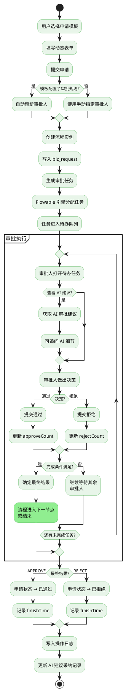
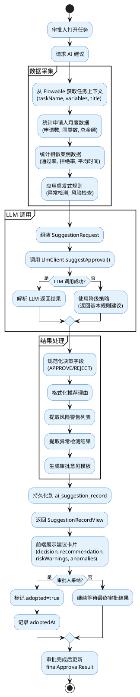
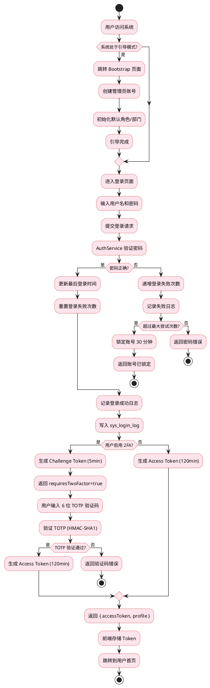
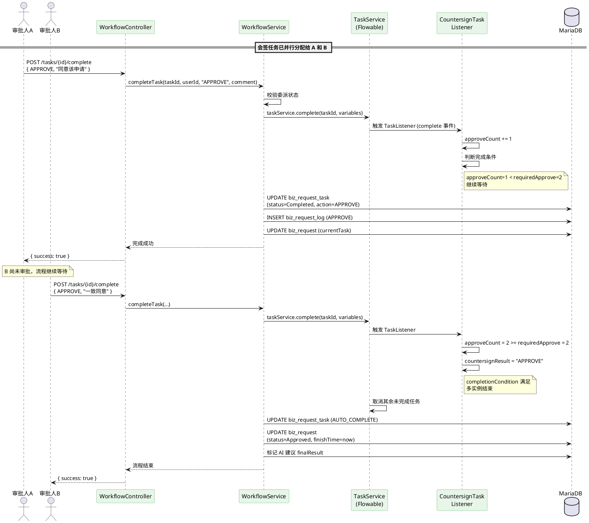
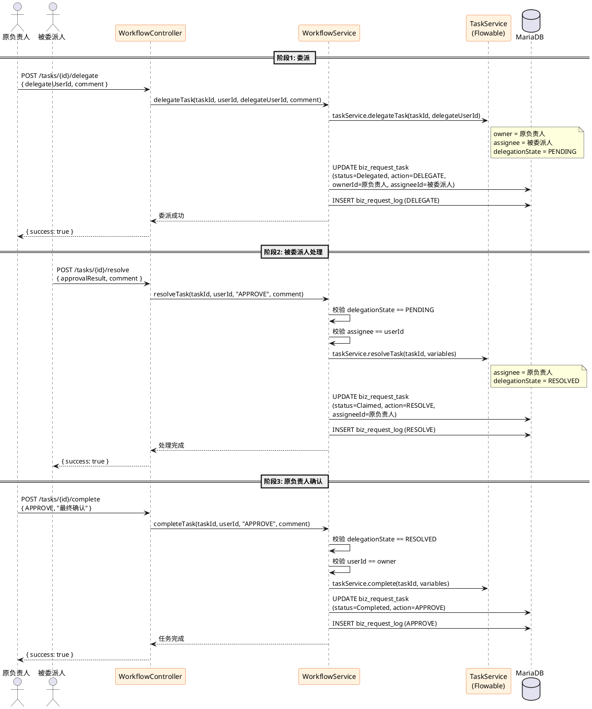
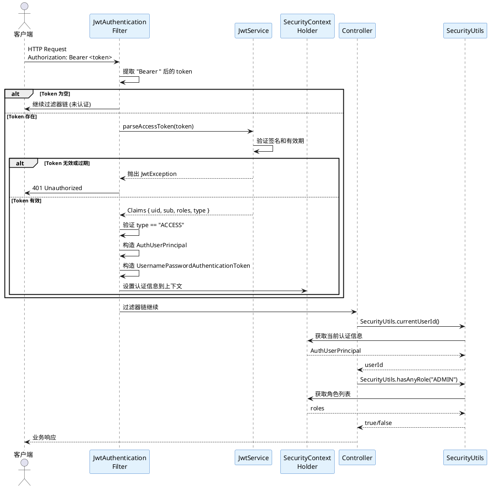

# 用例图与流程图 (PlantUML)

## 1. 系统用例图

```plantuml
@startuml 系统用例图
left to right direction
skinparam packageStyle rectangle

actor "普通员工" as EMP
actor "部门主管" as MGR
actor "流程设计员" as DSG
actor "系统管理员" as ADM

rectangle "智能协同审批系统" {
  
  package "审批流程" {
    usecase "发起申请" as UC01
    usecase "保存草稿" as UC02
    usecase "查看申请进度" as UC03
    usecase "撤销申请" as UC04
    usecase "认领任务" as UC05
    usecase "审批通过/拒绝" as UC06
    usecase "委派任务" as UC07
    usecase "转办任务" as UC08
    usecase "回退审批" as UC09
    usecase "查看审批历史" as UC10
  }
  
  package "AI 智能辅助" {
    usecase "查看 AI 审批建议" as UC11
    usecase "追问 AI 建议" as UC12
    usecase "自然语言填写表单" as UC13
    usecase "AI 聊天助手" as UC14
  }
  
  package "动态表单" {
    usecase "填写动态表单" as UC15
    usecase "上传附件" as UC16
    usecase "管理表单定义" as UC17
    usecase "管理表单版本" as UC18
    usecase "配置表单字段" as UC19
  }
  
  package "工作流管理" {
    usecase "管理流程定义" as UC20
    usecase "编辑 BPMN 流程" as UC21
    usecase "发布流程版本" as UC22
    usecase "配置审批节点" as UC23
    usecase "管理申请模板" as UC24
  }
  
  package "权限管理" {
    usecase "管理用户" as UC25
    usecase "管理角色" as UC26
    usecase "管理部门" as UC27
    usecase "管理岗位" as UC28
    usecase "配置数据权限" as UC29
    usecase "CSV 批量导入用户" as UC30
  }
  
  package "个人中心" {
    usecase "修改密码" as UC31
    usecase "设置双因素认证" as UC32
    usecase "查看登录日志" as UC33
  }
}

EMP --> UC01
EMP --> UC02
EMP --> UC03
EMP --> UC04
EMP --> UC05
EMP --> UC06
EMP --> UC10
EMP --> UC11
EMP --> UC12
EMP --> UC13
EMP --> UC14
EMP --> UC15
EMP --> UC16
EMP --> UC31
EMP --> UC32

MGR --> UC01
MGR --> UC03
MGR --> UC05
MGR --> UC06
MGR --> UC07
MGR --> UC08
MGR --> UC09
MGR --> UC10
MGR --> UC11
MGR --> UC12

DSG --> UC17
DSG --> UC18
DSG --> UC19
DSG --> UC20
DSG --> UC21
DSG --> UC22
DSG --> UC23

ADM --> UC20
ADM --> UC21
ADM --> UC22
ADM --> UC23
ADM --> UC24
ADM --> UC25
ADM --> UC26
ADM --> UC27
ADM --> UC28
ADM --> UC29
ADM --> UC30
ADM --> UC33

@enduml
```



## 2. 审批主流程图



## 3. AI 审批建议生成流程图



## 4. 自然语言表单解析流程图

```plantuml
@startuml 表单解析
skinparam ActivityBackgroundColor #FFF3E0
skinparam ActivityBorderColor #E65100

start
:用户输入自然语言描述;
:选择目标表单/模板;

:获取表单字段定义列表;

if (LLM 服务可用?) then (是)
  :构造 FieldDefinition 列表;
  :调用 LlmClient.parseFormCommand();
  if (LLM 解析成功?) then (是)
    :使用 LLM 解析结果;
    :设置 model = LLM模型名;
  else (否)
    :降级到启发式解析;
    :设置 model = heuristic;
  endif
else (否)
  :直接使用启发式解析;
  :设置 model = heuristic;
endif

partition "启发式解析 (备选)" {
  :遍历表单字段;
  repeat
    if (字段类型?) then (number)
      :正则匹配数值
      排除日期干扰;
    else (date/datetime)
      :匹配 ISO/中文日期;
    else (select)
      :关键词匹配选项;
    else (string)
      :字段别名匹配提取;
    endif
    if (是金额字段?) then (是)
      :货币符号+关键词匹配;
    endif
    if (是天数字段?) then (是)
      :中文数字+日期区间算天数;
    endif
  repeat while (还有字段?) is (是)
}

:合并默认值;
:识别缺失必填字段;

if (置信度 >= 阈值?) then (高)
  :自动填充表单;
else (低)
  :提示用户补充缺失字段;
endif

:用户确认/修改;
:发起审批流程;

stop
@enduml
```

## 5. 用户登录认证流程图



## 6. 会签审批时序图



## 7. 任务委派与完成时序图



## 8. JWT 认证请求过滤时序图


