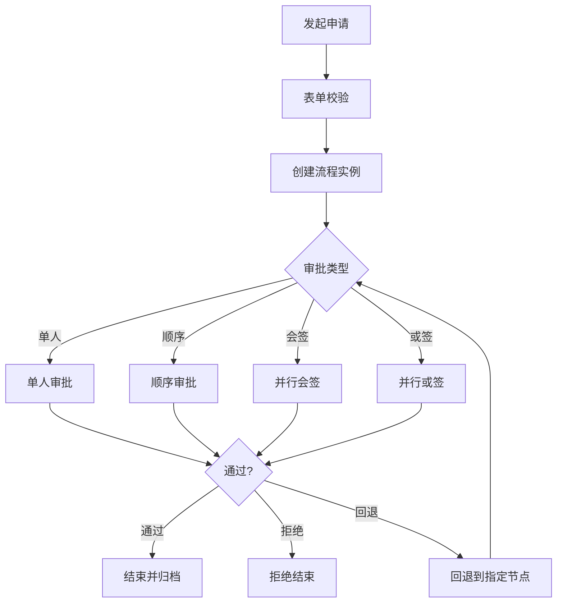
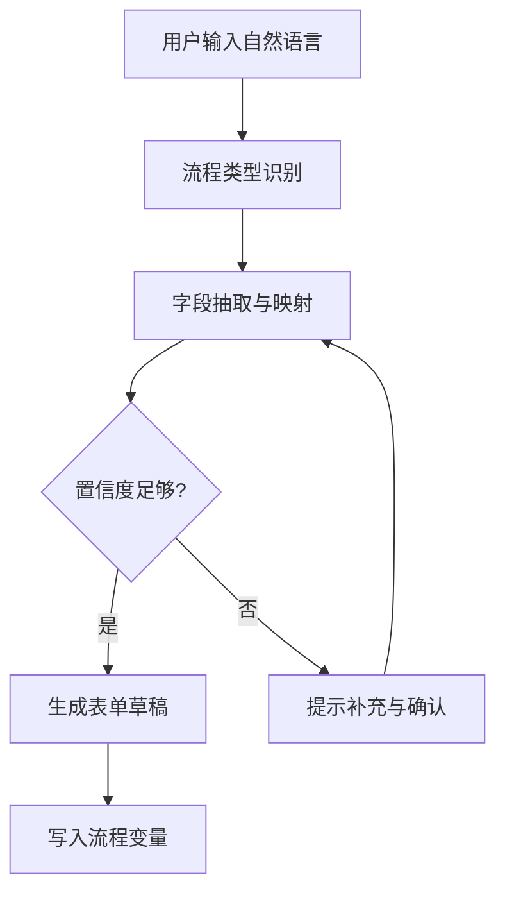

# 《基于 Flowable 工作流引擎的智能协同审批系统》深度需求细化

## 1. 引言
本文件基于 `docs/basic-requirements.md` 的开题要求，对系统功能、AI 集成、动态表单、数据库与非功能性需求进行细化，作为后续设计与实现的需求规格依据。

## 2. 术语与范围
**术语**
- **流程定义**：BPMN 2.0 流程模型与版本。
- **流程实例**：流程定义的运行实例，绑定业务主键 `businessKey`。
- **任务**：Flowable `UserTask` 实例，可被候选人认领或自动分配。
- **流程变量**：`Process Variables`，承载业务数据与路由条件。
- **会签**：多审批人并行审批，满足特定通过条件后流转。
- **或签**：多个审批人并行/并列，任意一人通过即流转。
- **委派**：当前任务负责人将任务暂时委派给他人处理，原负责人保留责任。
- **转办**：将任务永久转给他人，责任转移。

**范围**
- 涵盖流程发起、审批、会签、或签、委派、回退、动态表单、RBAC 与 AI 辅助能力。
- 不包含多租户隔离与跨系统流程编排。

## 3. 功能细化

### 3.1 业务对象
- **申请单**：业务主实体，记录发起人、表单数据、当前状态。
- **审批任务**：与流程实例绑定的待办项。
- **动态表单**：自定义字段集合，与流程变量一一映射。

### 3.2 状态机定义
**申请单状态**
| 状态 | 含义 | 进入条件 | 退出条件 |
| --- | --- | --- | --- |
| Draft | 草稿 | 用户保存未提交 | 提交发起流程 |
| Submitted | 已提交 | 发起成功 | 进入审批/被撤销 |
| InApproval | 审批中 | 任一审批任务生成 | 全部通过/拒绝/回退 |
| Approved | 已通过 | 通过条件满足 | 归档/后续业务执行 |
| Rejected | 已拒绝 | 任一拒绝生效 | 归档/重提 |
| Returned | 已退回 | 回退到发起人 | 重新提交/取消 |
| Cancelled | 已撤销 | 发起人撤销 | 归档 |

**任务状态**
| 状态 | 含义 | 进入条件 | 退出条件 |
| --- | --- | --- | --- |
| Ready | 待认领 | 候选人任务生成 | 认领/转办/委派 |
| Claimed | 已认领 | 用户认领 | 完成/委派/转办 |
| Delegated | 委派中 | 委派给他人 | 被处理后返还 |
| Completed | 已完成 | 审批提交 | 流程继续 |
| Returned | 已回退 | 退回节点处理 | 重新提交 |
| Suspended | 已挂起 | 流程挂起 | 激活/终止 |

### 3.3 审批场景与逻辑
**单人审批**
- 任务唯一审批人。
- 通过即进入下一节点，拒绝即结束或流转至拒绝处理节点。

**顺序审批（串行）**
- 多审批节点按顺序执行。
- 每一节点必须完成（通过或拒绝）才触发下一节点。

**会签（并行）—功能需求规约**

#### 会签操作 1：会签任务生成
前置条件：流程实例运行到并行会签的多实例 `UserTask`；已计算候选/审批人列表；申请单状态为 `InApproval`。  
操作输入：`countersignUsers`（审批人 ID 列表）、`countersignMode`（ALL/MAJORITY）、`passRatio`（多数通过阈值）。  
系统处理（重点结合 Flowable）：使用 BPMN 多实例并行任务配置（`multiInstanceLoopCharacteristics`），以 `countersignUsers` 作为集合变量；Flowable 自动创建多条任务实例并设置候选/指派人；系统写入 `biz_request_task`，每个任务记录 `task_id`、`assignee_id`、`status=Ready`、`action=CREATE`。  
后置条件与输出：`nrOfInstances`、`nrOfActiveInstances` 等多实例变量可用；审批任务进入待办队列；申请单维持 `InApproval` 状态。

#### 会签操作 2：审批人同意（会签通过）
前置条件：任务状态为 `Ready` 或 `Claimed`；当前用户为候选人或审批人；流程实例未结束。  
操作输入：`approvalResult=APPROVE`、审批意见、附件（可选）。  
系统处理（重点结合 Flowable）：如为 `Ready` 则 `taskService.claim(taskId, userId)`；写入审批意见 `taskService.addComment`；调用 `taskService.complete(taskId, variables)` 提交 `approvalResult` 与统计变量（如 `approveCount`）；更新 `biz_request_task` 为 `status=Completed`、`action=APPROVE`。  
后置条件与输出：Flowable 更新 `nrOfCompletedInstances`；若 `completionCondition` 满足通过条件则进入下一节点，否则继续等待剩余会签任务。

#### 会签操作 3：审批人拒绝（会签拒绝）
前置条件：任务状态为 `Ready` 或 `Claimed`；当前用户为候选人或审批人；流程实例未结束。  
操作输入：`approvalResult=REJECT`、拒绝原因、附件（可选）。  
系统处理（重点结合 Flowable）：如为 `Ready` 则先 `taskService.claim`；写入审批意见；`taskService.complete(taskId, variables)` 并更新拒绝统计（如 `rejectCount`）；`biz_request_task` 更新为 `status=Completed`、`action=REJECT`。  
后置条件与输出：若达到拒绝阈值（全票模式任一拒绝、或多数模式拒绝比例达到阈值）则流程进入拒绝分支；否则继续等待其他会签任务。

#### 会签操作 4：会签自动结束剩余任务
前置条件：会签 `completionCondition` 满足（通过或拒绝）。  
操作输入：无。  
系统处理（重点结合 Flowable）：Flowable 结束多实例容器，未完成的任务被自动取消；通过 `TaskListener` 或 `ExecutionListener` 捕捉任务删除事件，批量更新 `biz_request_task` 为 `status=Completed`、`action=AUTO_COMPLETE`。  
后置条件与输出：流程进入下一节点或拒绝处理节点；会签任务全部闭环完成。

**或签**
- 多人同时审批。
- 任一审批人通过即进入下一节点。
- 首次通过后，其余任务自动结束并记录为“自动完成”。

### 3.4 委派与转办
**委派（Delegation）—功能需求规约**

#### 委派操作 1：发起委派
前置条件：任务状态为 `Claimed`；当前用户为任务指派人或具备委派权限；任务未处于委派中。  
操作输入：`delegate_user_id`、委派原因/说明。  
系统处理（重点结合 Flowable）：调用 `taskService.delegateTask(taskId, delegateUserId)`；写入委派意见 `taskService.addComment`；更新 `biz_request_task`：`status=Delegated`、`action=DELEGATE`、`assignee_id=delegate_user_id`。  
后置条件与输出：Flowable 设置 `owner=原负责人`、`assignee=被委派人`；任务进入 `Delegated` 状态，等待被委派人处理。

#### 委派操作 2：被委派人处理并提交
前置条件：任务状态为 `Delegated`；当前用户为被委派人。  
操作输入：`approvalResult`（APPROVE/REJECT）、处理意见、附件（可选）。  
系统处理（重点结合 Flowable）：写入处理意见；调用 `taskService.resolveTask(taskId, variables)` 将结果返回原负责人；更新 `biz_request_task`：`status=Claimed`、`action=RESOLVE`、`assignee_id=owner`（从 Flowable 任务读取）。  
后置条件与输出：任务重新回到原负责人，等待最终确认。

#### 委派操作 3：原负责人确认并完成
前置条件：任务状态为 `Claimed`；当前用户为任务 `owner` 且 `delegationState=RESOLVED`。  
操作输入：最终审批意见（APPROVE/REJECT）、备注。  
系统处理（重点结合 Flowable）：写入审批意见；`taskService.complete(taskId, variables)`；更新 `biz_request_task`：`status=Completed`、`action=APPROVE/REJECT`。  
后置条件与输出：流程继续到下一节点或进入拒绝分支。

**转办（Reassign）—功能需求规约**

#### 转办操作 1：发起转办
前置条件：任务状态为 `Ready` 或 `Claimed`；当前用户为任务指派人或管理员；任务未结束。  
操作输入：`new_assignee_id`、转办原因。  
系统处理（重点结合 Flowable）：\n- 若任务为 `Ready`：`taskService.claim(taskId, newAssigneeId)`。\n- 若任务为 `Claimed`：`taskService.setAssignee(taskId, newAssigneeId)`。\n写入转办意见；更新 `biz_request_task`：`status=Claimed`、`action=REASSIGN`、`assignee_id=new_assignee_id`。  
后置条件与输出：任务责任转移至新负责人；原负责人不再参与该任务。

### 3.5 回退策略
- **回退到上一步**：返回上一审批节点，生成新的任务。
- **回退到指定节点**：允许跳转到指定节点，需记录回退原因。
- **回退到发起人**：申请单进入 `Returned` 状态，发起人可修改后重提。

### 3.6 通用规则
- 所有审批动作必须记录审批意见与时间。
- 审批任务与流程实例必须关联 `businessKey`。
- 任务分配支持候选人、候选角色、候选岗位。

### 3.7 账号开通与注册策略
**总体策略**
- 系统默认关闭匿名公开注册，不提供“任意用户自助注册并直接入组织”能力。
- 仅允许以下两种账号开通方式：
  1. 管理员发放邀请码，成员通过一次性邀请链接完成注册；
  2. 管理员通过 CSV 批量导入用户。

**邀请码注册（Invite-Only Signup）—功能需求规约**

#### 邀请码操作 1：管理员创建邀请码
前置条件：当前用户具备系统管理员权限；目标角色/部门/岗位配置合法。  
操作输入：`invite_scope`（组织/部门）、`role_ids`、`dept_id`、`post_ids`、`expires_at`、`max_use_count`（默认 1）。  
系统处理：生成高强度随机 `invite_token`；仅持久化 token 哈希值；写入邀请码记录状态 `ACTIVE`；记录创建人、有效期与可绑定权限范围。  
后置条件与输出：返回一次性注册链接（含 token）与过期时间；默认仅允许单次使用。

#### 邀请码操作 2：成员使用邀请码注册
前置条件：邀请码状态为 `ACTIVE`；未过期；未超过可用次数；来源组织匹配。  
操作输入：`invite_token`、`username`、`password`、基础资料。  
系统处理：校验 token 哈希、状态、有效期与使用次数；校验用户名唯一性与密码策略；创建用户并绑定邀请码限定的角色/部门/岗位；邀请码状态更新为 `USED`（或递减剩余次数）；写入审计日志。  
后置条件与输出：用户账号激活成功；若组织开启 2FA 强制策略，则注册后首次登录必须完成 2FA 绑定。

#### 邀请码操作 3：管理员撤销邀请码
前置条件：当前用户具备系统管理员权限；邀请码仍可用。  
操作输入：`invite_id`、撤销原因。  
系统处理：邀请码状态更新为 `REVOKED`；写入操作日志。  
后置条件与输出：该邀请码立即失效，后续注册链接不可用。

**CSV 批量导入用户—功能需求规约**

#### 导入操作 1：上传并预校验（Dry-Run）
前置条件：当前用户具备系统管理员权限；上传文件为 CSV。  
操作输入：CSV 文件（建议字段：`username,password,dept_code,post_codes,role_codes,status`）、导入策略（`CREATE_ONLY/UPSERT`）。  
系统处理：校验表头、编码与行数上限；逐行做用户名重复、部门/岗位/角色存在性、密码强度等检查；生成错误清单与预览结果，不落库。  
后置条件与输出：返回校验报告（成功行数、失败行数、失败原因明细）。

#### 导入操作 2：确认导入执行
前置条件：Dry-Run 通过或管理员确认忽略错误行；导入任务未在执行中。  
操作输入：`import_job_id`、执行选项（是否跳过错误行、是否发送初始密码通知）。  
系统处理：按策略批量创建或更新用户，绑定角色/岗位/部门；逐行记录导入结果（成功/失败/原因）；输出汇总统计。  
后置条件与输出：生成可下载的导入结果报告；失败行可导出并二次修复重试。

#### 导入操作 3：导入审计与回溯
前置条件：导入任务已完成。  
操作输入：`import_job_id`。  
系统处理：提供任务级与行级审计信息（操作者、时间、源文件摘要、变更前后关键字段摘要）。  
后置条件与输出：支持按任务查看导入影响范围与失败原因，用于审计和追责。

## 4. AI 集成点

### 4.1 UserTask 审批建议
**触发时机**
- 用户打开审批任务或加载表单时触发。

**输入**
- 表单字段、历史审批记录、流程定义摘要、风险规则。

**输出**
- 建议审批意见、风险提示、参考摘要。

**落地方式**
- 仅作为 UI 提示，不自动写入审批结果。

### 4.2 ServiceTask 异步增强
**触发时机**
- 表单提交后、关键审批节点前。

**输出示例**
- `ai_risk_score`、`ai_flags`、`ai_summary`。

**用途**
- 为后续网关条件或人工判断提供参考变量。

### 4.3 表单指令自然语言解析
**目标**
- 用户输入自然语言，自动生成表单草稿与流程变量。

**处理步骤**
1. **流程类型识别**：识别发起哪类流程。
2. **槽位抽取**：抽取字段值并映射到表单字段。
3. **校验与补全**：缺失字段提示与建议值。
4. **置信度控制**：低置信度必须人工确认。

**结构化输出**
```json
{
  "processKey": "travel_request",
  "confidence": 0.82,
  "fields": {
    "destination": "上海",
    "budget": 3000,
    "days": 3
  },
  "missingFields": ["reason"]
}
```

### 4.4 模型适配层设计
- 抽象接口 `LlmClient`，支持可切换 GPT 或国产模型。
- 统一输出为 JSON Schema，降低解析风险。
- 记录调用日志与输入输出摘要，用于审计与回溯。

## 5. 动态表单设计

### 5.1 表单字段元模型
| 字段 | 说明 |
| --- | --- |
| field_key | 字段唯一标识，与流程变量映射 |
| field_type | string/number/date/select/table |
| required | 是否必填 |
| default_value | 默认值 |
| visible_rule | 可见性条件 |
| validate_rule | 校验规则 |

### 5.2 映射规则
- **一对一映射**：`field_key` 对应流程变量同名键。
- **复杂字段**：表格或明细以 JSON 存为单一变量。
- **类型转换**：前端提交时完成格式转换；后端二次校验。

### 5.3 版本与流程绑定
- 每个流程定义版本绑定唯一表单版本。
- 已运行流程实例保持表单版本不变。

## 6. 数据库建模建议

### 6.1 RBAC 核心扩展表
| 表名 | 核心字段 |
| --- | --- |
| sys_user | id, username, password, dept_id, status, two_factor_enabled, two_factor_secret |
| sys_role | id, role_code, role_name, status |
| sys_post | id, post_code, post_name |
| sys_dept | id, parent_id, dept_name |
| sys_user_role | user_id, role_id |
| sys_user_post | user_id, post_id |
| sys_role_data_scope | role_id, dept_id, scope_type |
| sys_user_invite | id, invite_code_hash, role_ids_json, dept_id, post_ids_json, max_use_count, used_count, expires_at, status, created_by |
| sys_user_import_job | id, file_name, file_sha256, strategy, status, total_count, success_count, fail_count, created_by, started_at, finished_at |
| sys_user_import_item | id, import_job_id, row_no, username, result_status, error_message |

### 6.2 表单与流程扩展表
| 表名 | 核心字段 |
| --- | --- |
| form_definition | id, form_name, form_key, status |
| form_version | id, form_id, version, schema_json |
| form_field | id, form_version_id, field_key, field_type, required |
| form_instance | id, form_version_id, business_key, data_json |

### 6.3 审批业务扩展表（数据字典）

**表：`biz_request`（申请单主表）**
| Field | Type & Length | PK | FK | Null | Default | Comment |
| --- | --- | --- | --- | --- | --- | --- |
| id | BIGINT | Y | N | N | auto_increment | 主键 |
| business_key | VARCHAR(64) | N | N | N | - | 业务主键，唯一标识申请单 |
| process_instance_id | VARCHAR(64) | N | N | N | - | Flowable 流程实例 ID |
| process_definition_id | VARCHAR(64) | N | N | N | - | Flowable 流程定义 ID |
| form_instance_id | BIGINT | N | FK -> form_instance.id | N | - | 关联表单实例 |
| applicant_id | BIGINT | N | FK -> sys_user.id | N | - | 发起人用户 ID |
| applicant_dept_id | BIGINT | N | FK -> sys_dept.id | Y | NULL | 发起人部门 ID |
| title | VARCHAR(128) | N | N | N | - | 申请标题 |
| status | TINYINT | N | N | N | 0 | 申请状态：0草稿/1已提交/2审批中/3通过/4拒绝/5退回/6撤销 |
| current_task_id | VARCHAR(64) | N | N | Y | NULL | 当前待办任务 ID |
| current_assignee_id | BIGINT | N | FK -> sys_user.id | Y | NULL | 当前处理人 |
| submit_time | DATETIME | N | N | Y | NULL | 提交时间 |
| finish_time | DATETIME | N | N | Y | NULL | 结束时间 |
| created_at | DATETIME | N | N | N | CURRENT_TIMESTAMP | 创建时间 |
| updated_at | DATETIME | N | N | N | CURRENT_TIMESTAMP | 更新时间 |
| is_deleted | TINYINT | N | N | N | 0 | 逻辑删除标记 |

**表：`biz_request_task`（任务关联表）**
| Field | Type & Length | PK | FK | Null | Default | Comment |
| --- | --- | --- | --- | --- | --- | --- |
| id | BIGINT | Y | N | N | auto_increment | 主键 |
| business_key | VARCHAR(64) | N | FK -> biz_request.business_key | N | - | 申请单业务主键 |
| process_instance_id | VARCHAR(64) | N | N | N | - | 流程实例 ID |
| task_id | VARCHAR(64) | N | N | N | - | Flowable 任务 ID |
| task_name | VARCHAR(128) | N | N | Y | NULL | 任务名称 |
| assignee_id | BIGINT | N | FK -> sys_user.id | Y | NULL | 任务办理人 |
| owner_id | BIGINT | N | FK -> sys_user.id | Y | NULL | 任务委派时的原负责人 |
| status | TINYINT | N | N | N | 0 | 任务状态：0待认领/1已认领/2委派中/3已完成/4已回退/5挂起 |
| action | VARCHAR(32) | N | N | Y | NULL | 动作：APPROVE/REJECT/DELEGATE/RESOLVE/REASSIGN/AUTO_COMPLETE |
| comment | VARCHAR(512) | N | N | Y | NULL | 审批意见/说明 |
| start_time | DATETIME | N | N | Y | NULL | 任务开始时间 |
| end_time | DATETIME | N | N | Y | NULL | 任务完成时间 |
| created_at | DATETIME | N | N | N | CURRENT_TIMESTAMP | 创建时间 |
| updated_at | DATETIME | N | N | N | CURRENT_TIMESTAMP | 更新时间 |

**表：`biz_request_log`（审批操作日志）**
| Field | Type & Length | PK | FK | Null | Default | Comment |
| --- | --- | --- | --- | --- | --- | --- |
| id | BIGINT | Y | N | N | auto_increment | 主键 |
| business_key | VARCHAR(64) | N | FK -> biz_request.business_key | N | - | 申请单业务主键 |
| process_instance_id | VARCHAR(64) | N | N | N | - | 流程实例 ID |
| task_id | VARCHAR(64) | N | N | Y | NULL | 任务 ID |
| operator_id | BIGINT | N | FK -> sys_user.id | N | - | 操作人 |
| action | VARCHAR(32) | N | N | N | - | 操作类型：SUBMIT/APPROVE/REJECT/DELEGATE/RESOLVE/REASSIGN/RETURN/CANCEL |
| comment | VARCHAR(512) | N | N | Y | NULL | 操作意见 |
| created_at | DATETIME | N | N | N | CURRENT_TIMESTAMP | 创建时间 |

## 7. 非功能性需求

### 7.1 事务一致性
- Flowable 与业务库在同一数据源与事务上下文。
- 核心操作（发起、完成任务、回退）必须在 `@Transactional` 中完成。
- 使用 Flowable 事务同步监听器确保流程变量与业务表一致。
- 失败回滚：业务表写入失败时流程实例回滚。

### 7.2 安全性
- **认证**：JWT 或 Session，支持二因素认证（2FA）。
- **认证增强（2FA）**：支持基于 TOTP 的动态口令校验；登录在密码校验通过后进入 2FA 挑战；支持恢复码与设备解绑审计。
- **注册策略**：默认关闭匿名公开注册；仅支持管理员邀请码注册与管理员批量导入开户。
- **邀请码安全**：邀请码必须为高熵随机串且仅保存哈希值；默认一次性、限时有效；支持撤销与使用次数限制；注册成功后立即失效。
- **授权**：RBAC + 数据范围过滤。
- **导入安全**：CSV 导入必须经过 Dry-Run 预校验；记录行级错误与操作审计；限制单次导入行数与请求频率，防止批量滥用。
- **脱敏/加密**：预算、证件号等敏感字段加密存储。
- **审计**：审批操作日志不可篡改，保留审批链路。
- **LLM 数据安全**：调用前脱敏，日志只存摘要。
- **反机器人与防滥用**：生产环境在注册、登录、找回密码、批量提交等高风险接口接入 Cloudflare Turnstile，拦截机器人与批量滥用请求。

### 7.3 性能与可用性
- 高频待办查询使用索引与缓存优化。
- 大字段（表单 JSON）与日志表分离存储。
- 流程设计器与审批页面支持前端懒加载。

## 8. Mermaid 流程图

**审批主流程**


**LLM 解析与表单生成**


## 9. 用户与用例分析

### 9.1 业务角色定义
| 角色 | 说明 |
| --- | --- |
| 普通员工 | 发起业务申请与跟踪状态的主要用户 |
| 部门主管 | 负责本部门审批、可进行委派或回退 |
| 流程设计员 | 负责流程建模、发布与表单绑定 |
| 系统管理员 | 负责用户、角色、权限与系统参数配置 |

### 9.2 角色用例清单（按模块）
**普通员工**
| 模块 | 用例 |
| --- | --- |
| 发起申请 | 创建草稿、填写表单、提交申请、撤销申请、查看进度 |
| 审批任务 | 在被配置为审批人时，认领任务、提交意见、同意/拒绝 |
| 流程设计 | 无权限 |
| 权限配置 | 无权限 |

**部门主管**
| 模块 | 用例 |
| --- | --- |
| 发起申请 | 创建草稿、提交申请、撤销申请、查看进度 |
| 审批任务 | 审批下属申请、委派/转办、回退、查看历史意见 |
| 流程设计 | 无权限 |
| 权限配置 | 无权限 |

**流程设计员**
| 模块 | 用例 |
| --- | --- |
| 发起申请 | 发起测试流程、查看实例状态 |
| 审批任务 | 仅处理测试或被分配任务 |
| 流程设计 | 新建流程、编辑节点、配置网关条件、发布与版本管理、绑定表单 |
| 权限配置 | 无权限（由系统管理员负责） |

**系统管理员**
| 模块 | 用例 |
| --- | --- |
| 发起申请 | 发起测试流程、查看实例状态 |
| 审批任务 | 处理被分配任务、查看全局审批统计 |
| 流程设计 | 审核流程发布、维护流程模板 |
| 权限配置 | 用户管理、角色配置、岗位配置、数据范围与菜单授权、发放邀请码、撤销邀请码、CSV 批量导入用户、查看导入审计报告 |

### 9.3 角色与权限矩阵
| 角色 | 发起申请 | 审批任务 | 流程设计 | 权限配置 |
| --- | --- | --- | --- | --- |
| 普通员工 | 允许 | 条件允许（被配置为审批人） | 无权限 | 无权限 |
| 部门主管 | 允许 | 允许 | 无权限 | 无权限 |
| 流程设计员 | 允许（测试） | 条件允许 | 允许 | 无权限 |
| 系统管理员 | 允许（测试） | 允许 | 允许 | 允许 |

## 10. 需求验收与测试场景
- 并行会签：全票通过与多数通过两种模式均可配置。
- 或签：任一审批人通过即进入下一节点。
- 委派：原负责人最终确认任务完成。
- 回退：支持回退到上一节点、指定节点、发起人。
- LLM 解析：正常指令与缺失字段的提示机制可用。
- 安全：数据范围隔离、审计日志完整可追溯。
- 2FA：密码正确但未通过二次验证码时禁止登录；通过二次验证码后才允许建立会话。
- 邀请码注册：仅管理员可创建邀请码；邀请码超时或撤销后不可注册；同一一次性邀请码不可重复使用。
- CSV 批量导入：支持 Dry-Run 预校验与正式执行两阶段；导入完成后可查看成功/失败明细与错误原因。
- Cloudflare Turnstile（生产）：注册/登录等高风险接口在未通过 Turnstile 校验时拒绝请求，通过后方可继续业务处理。
