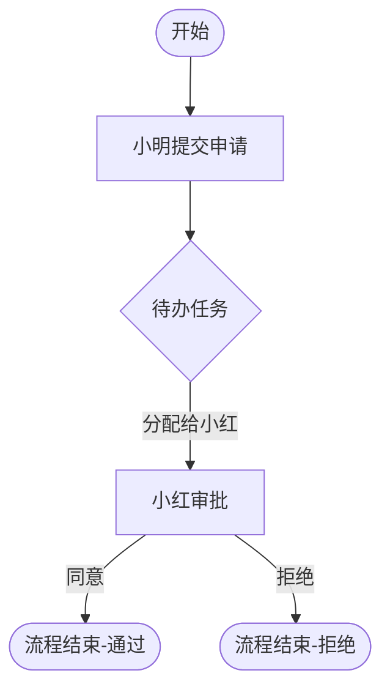

# 单人审批示例说明

## 场景概述

**场景：员工出差申请**

这是一个典型的单人审批流程，只需一位审批人即可完成审批。

---

## 流程步骤

```
申请人 → 部门主管审批 → 结束
```

---

## 具体过程

### 1️⃣ 发起人提交申请

员工小明（ID: 1001）提交差旅申请：

```
┌─────────────────────────────────┐
│  出差申请单                     │
│  ─────────────────────────────  │
│  申请人：小明 (1001)            │
│  目的地：上海                   │
│  预算：3000 元                  │
│  事由：客户拜访                 │
└─────────────────────────────────┘
```

**系统操作：**
- 创建流程实例
- 根据规则确定审批人（小明直属主管：小红，ID: 1002）
- 生成待办任务给小红

---

### 2️⃣ 审批人处理任务

小红收到待办任务通知：

```
┌─────────────────────────────────┐
│  待办审批任务                   │
│  ─────────────────────────────  │
│  申请人：小明                   │
│  申请内容：上海出差，预算 3000 元│
│  ─────────────────────────────  │
│  [同意]  [拒绝]                 │
└─────────────────────────────────┘
```

**小红可以执行的操作：**
- 查看申请详情
- 添加审批意见
- 点击"同意"或"拒绝"

---

### 3️⃣ 审批结果

#### 情况 A - 同意通过

```
小红点击"同意"并填写意见：同意，预算合理
    ↓
┌─────────────────────────────────┐
│  申请单状态更新为"已通过"       │
│  流程结束                       │
│  小明可收到通知                 │
└─────────────────────────────────┘
```

#### 情况 B - 拒绝申请

```
小红点击"拒绝"并填写原因：预算过高
    ↓
┌─────────────────────────────────┐
│  申请单状态更新为"已拒绝"       │
│  流程结束                       │
│  小明可收到通知                 │
└─────────────────────────────────┘
```

---

## 单人审批的特点

| 特点 | 说明 |
|------|------|
| **审批人唯一** | 每次只有一个审批人，无需协调多人 |
| **无需等待** | 不需要等待其他人审批，决策效率高 |
| **流程简单** | 通过 → 结束 / 拒绝 → 结束，逻辑清晰 |
| **责任明确** | 审批责任完全由该审批人承担 |
| **快速响应** | 适合紧急、小额、常规性申请 |

---

## BPMN 流程图



---

## 适用场景

| 申请类型 | 说明 |
|---------|------|
| 请假申请 | 直属主管即可批准 |
| 小额报销 | 部门主管审批即可 |
| 常规出差 | 1000 元以内由主管决定 |
| 办公用品采购 | 低价值物品快速审批 |
| 调休申请 | 主管根据排班直接批准 |

---

## 代码实现说明

在你的项目中，单人审批对应 BPMN 流程图中只有一个**用户任务节点**：

```
开始 → [用户任务：部门主管审批] → 结束
```

Flowable 会根据流程配置（比如"候选人 = 发起人部门的主管"）自动确定审批人，生成一个待办任务给这个人处理。

---

## 相关 API

### 发起流程

```http
POST /api/workflow/requests
Content-Type: application/json

{
  "businessKey": "TR-20260314-001",
  "title": "出差申请 - 上海",
  "applicantId": "1001",
  "applicantDeptId": "10",
  "processKey": "travelRequest",
  "variables": {
    "destination": "上海",
    "amount": 3000,
    "reason": "客户拜访"
  }
}
```

### 完成任务

```http
POST /api/workflow/tasks/{taskId}/complete
Content-Type: application/json

{
  "userId": "1002",
  "approvalResult": "APPROVE",
  "comments": "同意，预算合理"
}
```

---

## 对比其他审批方式

| 审批类型 | 审批人数 | 通过条件 | 典型场景 |
|---------|---------|---------|---------|
| **单人审批** | 1 人 | 该人同意 | 请假、小额报销 |
| **顺序审批** | 多人按顺序 | 每人依次审批 | 大额报销、合同审批 |
| **会签** | 多人并行 | 全部同意或多数同意 | 采购合同、招聘录用 |
| **或签** | 多人并行 | 任意一人同意 | 活动场地预订 |

---

## 状态流转

```
┌─────────────────────────────────────────────────────────────┐
│  申请单状态机                                               │
│                                                             │
│  Draft(草稿) → Submitted(已提交)                            │
│                            ↓                                │
│                    InApproval(审批中)                       │
│                            ↓                                │
│         ┌──────────────────┼──────────────────┐            │
│         ↓                                  ↓            │
│  Approved(已通过)                Rejected(已拒绝)         │
└─────────────────────────────────────────────────────────────┘
```

---

**文档版本：** v1.0  
**最后更新：** 2026-03-14
