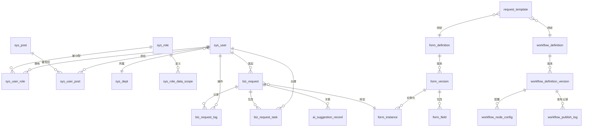

# 数据库设计文档

> 本文档基于实际 JPA 实体类反向推导，记录了系统完整的数据库表结构。

## 1. ER 图（核心实体关系）

## 2. 核心业务表详细结构

### 2.1 申请单主表 (biz_request)

| 字段 | 类型 | 约束 | 说明 |
|------|------|------|------|
| id | BIGINT | PK, AUTO_INCREMENT | 主键 |
| business_key | VARCHAR(64) | UNIQUE, NOT NULL | 业务主键 |
| process_instance_id | VARCHAR(64) | | Flowable 流程实例 ID |
| process_definition_id | VARCHAR(64) | | Flowable 流程定义 ID |
| form_instance_id | BIGINT | FK -> form_instance.id | 关联表单实例 |
| workflow_definition_id | BIGINT | | 工作流定义 ID |
| workflow_definition_version_id | BIGINT | | 工作流定义版本 ID |
| form_version_id | BIGINT | | 表单版本 ID |
| request_template_key | VARCHAR(64) | | 申请模板键 |
| applicant_id | BIGINT | FK -> sys_user.id, NOT NULL | 发起人 |
| applicant_dept_id | BIGINT | FK -> sys_dept.id | 发起人部门 |
| applicant_post_id | BIGINT | | 发起人岗位 |
| title | VARCHAR(128) | NOT NULL | 申请标题 |
| status | TINYINT | NOT NULL | 状态 (0-7) |
| current_task_id | VARCHAR(64) | | 当前待办任务ID |
| current_assignee_id | BIGINT | | 当前处理人 |
| submit_time | DATETIME | | 提交时间 |
| finish_time | DATETIME | | 结束时间 |
| created_at | DATETIME | NOT NULL | 创建时间 |
| updated_at | DATETIME | NOT NULL | 更新时间 |
| is_deleted | TINYINT | NOT NULL, DEFAULT 0 | 逻辑删除 |

### 2.2 审批任务表 (biz_request_task)

| 字段 | 类型 | 约束 | 说明 |
|------|------|------|------|
| id | BIGINT | PK, AUTO_INCREMENT | 主键 |
| business_key | VARCHAR(64) | NOT NULL | 业务主键 |
| process_instance_id | VARCHAR(64) | NOT NULL | 流程实例 ID |
| task_id | VARCHAR(64) | UNIQUE, NOT NULL | Flowable 任务 ID |
| task_name | VARCHAR(128) | | 任务名称 |
| assignee_id | BIGINT | | 办理人 |
| owner_id | BIGINT | | 委派原负责人 |
| status | TINYINT | NOT NULL | 状态 (0-4) |
| action | VARCHAR(32) | | 操作类型 |
| comment | VARCHAR(512) | | 审批意见 |
| start_time | DATETIME | | 开始时间 |
| end_time | DATETIME | | 结束时间 |
| created_at | DATETIME | NOT NULL | 创建时间 |
| updated_at | DATETIME | NOT NULL | 更新时间 |

### 2.3 审批操作日志表 (biz_request_log)

| 字段 | 类型 | 约束 | 说明 |
|------|------|------|------|
| id | BIGINT | PK, AUTO_INCREMENT | 主键 |
| business_key | VARCHAR(64) | NOT NULL | 业务主键 |
| process_instance_id | VARCHAR(64) | | 流程实例ID |
| task_id | VARCHAR(64) | | 任务ID |
| operator_id | BIGINT | FK -> sys_user.id, NOT NULL | 操作人 |
| action | VARCHAR(32) | NOT NULL | 操作类型 |
| comment | VARCHAR(512) | | 操作意见 |
| created_at | DATETIME | NOT NULL | 创建时间 |

### 2.4 AI 建议记录表 (ai_suggestion_record)

| 字段 | 类型 | 约束 | 说明 |
|------|------|------|------|
| id | BIGINT | PK, AUTO_INCREMENT | 主键 |
| business_key | VARCHAR(64) | NOT NULL | 业务主键 |
| process_instance_id | VARCHAR(64) | NOT NULL | 流程实例ID |
| task_id | VARCHAR(64) | NOT NULL | 任务ID |
| requester_id | BIGINT | NOT NULL | 请求人 |
| model | VARCHAR(128) | | 使用的模型 |
| suggestion_json | TEXT | NOT NULL | 建议内容 JSON |
| conversation_json | TEXT | | 对话历史 JSON |
| adopted | BOOLEAN | NOT NULL, DEFAULT FALSE | 是否被采纳 |
| adopted_at | DATETIME | | 采纳时间 |
| final_approval_result | VARCHAR(32) | | 最终审批结果 |
| created_at | DATETIME | NOT NULL | 创建时间 |
| updated_at | DATETIME | NOT NULL | 更新时间 |

## 3. 动态表单表

### 3.1 表单定义 (form_definition)

| 字段 | 类型 | 约束 | 说明 |
|------|------|------|------|
| id | BIGINT | PK, AUTO_INCREMENT | 主键 |
| form_name | VARCHAR(128) | NOT NULL | 表单名称 |
| form_key | VARCHAR(64) | UNIQUE, NOT NULL | 表单唯一标识 |
| status | INTEGER | NOT NULL | 状态 |

### 3.2 表单版本 (form_version)

| 字段 | 类型 | 约束 | 说明 |
|------|------|------|------|
| id | BIGINT | PK, AUTO_INCREMENT | 主键 |
| form_id | BIGINT | FK, NOT NULL | 关联表单定义 |
| version | INTEGER | NOT NULL | 版本号 |
| schema_json | TEXT | NOT NULL | 表单结构 JSON |
| status | VARCHAR(32) | | DRAFT/PUBLISHED/ARCHIVED |
| published_by | BIGINT | | 发布人 |
| published_at | DATETIME | | 发布时间 |

### 3.3 表单字段 (form_field)

| 字段 | 类型 | 约束 | 说明 |
|------|------|------|------|
| id | BIGINT | PK, AUTO_INCREMENT | 主键 |
| form_version_id | BIGINT | FK, NOT NULL | 关联表单版本 |
| field_key | VARCHAR(64) | NOT NULL | 字段标识 |
| variable_key | VARCHAR(64) | | 流程变量映射键 |
| field_type | VARCHAR(32) | NOT NULL | 字段类型 (string/number/date/select/table) |
| label | VARCHAR(128) | | 字段标签 |
| required | INTEGER | NOT NULL | 是否必填 |
| visible_rule | TEXT | | 可见条件规则 JSON |
| validate_rule | TEXT | | 校验规则 JSON |
| options_json | TEXT | | 选项列表 JSON (select 类型) |
| default_value | TEXT | | 默认值 |
| sort_order | INTEGER | | 排序 |

### 3.4 表单实例 (form_instance)

| 字段 | 类型 | 约束 | 说明 |
|------|------|------|------|
| id | BIGINT | PK, AUTO_INCREMENT | 主键 |
| form_version_id | BIGINT | FK, NOT NULL | 关联表单版本 |
| business_key | VARCHAR(64) | NOT NULL | 业务主键 |
| data_json | TEXT | NOT NULL | 表单数据 JSON |

### 3.5 表单附件 (form_attachment)

| 字段 | 类型 | 约束 | 说明 |
|------|------|------|------|
| id | BIGINT | PK, AUTO_INCREMENT | 主键 |
| form_instance_id | BIGINT | | 关联表单实例 |
| field_key | VARCHAR(64) | NOT NULL | 所属字段 |
| file_name | VARCHAR(255) | NOT NULL | 存储文件名 |
| original_name | VARCHAR(255) | NOT NULL | 原始文件名 |
| file_path | VARCHAR(512) | NOT NULL | 文件路径 |
| file_size | BIGINT | NOT NULL | 文件大小 |
| content_type | VARCHAR(128) | NOT NULL | MIME 类型 |
| created_at | DATETIME | NOT NULL | 创建时间 |

## 4. 工作流管理表

### 4.1 工作流定义 (workflow_definition)

| 字段 | 类型 | 约束 | 说明 |
|------|------|------|------|
| id | BIGINT | PK, AUTO_INCREMENT | 主键 |
| process_key | VARCHAR(64) | UNIQUE, NOT NULL | 流程标识 |
| process_name | VARCHAR(128) | NOT NULL | 流程名称 |
| category | VARCHAR(64) | | 分类 |
| description | VARCHAR(512) | | 描述 |
| status | VARCHAR(32) | NOT NULL | DRAFT/ACTIVE/INACTIVE/ARCHIVED |
| current_version_id | BIGINT | | 当前版本 ID |
| latest_version_no | INTEGER | NOT NULL | 最新版本号 |
| created_by | BIGINT | NOT NULL | 创建人 |
| updated_by | BIGINT | | 更新人 |
| created_at | DATETIME | NOT NULL | 创建时间 |
| updated_at | DATETIME | NOT NULL | 更新时间 |
| is_deleted | INTEGER | NOT NULL, DEFAULT 0 | 逻辑删除 |

### 4.2 工作流定义版本 (workflow_definition_version)

| 字段 | 类型 | 约束 | 说明 |
|------|------|------|------|
| id | BIGINT | PK, AUTO_INCREMENT | 主键 |
| definition_id | BIGINT | FK, NOT NULL | 关联流程定义 |
| version_no | INTEGER | NOT NULL | 版本号 |
| version_label | VARCHAR(64) | | 版本标签 |
| status | VARCHAR(32) | NOT NULL | DRAFT/PUBLISHED/INACTIVE/RETIRED |
| bpmn_xml | LONGTEXT | NOT NULL | BPMN 2.0 XML |
| bpmn_checksum | VARCHAR(64) | | XML 校验和 |
| flowable_deployment_id | VARCHAR(64) | | Flowable 部署 ID |
| flowable_process_definition_id | VARCHAR(128) | | Flowable 流程定义 ID |
| form_key | VARCHAR(64) | | 绑定表单键 |
| form_version_id | BIGINT | | 绑定表单版本 ID |
| change_summary | VARCHAR(1000) | | 变更说明 |
| published_by | BIGINT | | 发布人 |
| published_at | DATETIME | | 发布时间 |
| created_by | BIGINT | NOT NULL | 创建人 |
| updated_by | BIGINT | | 更新人 |
| created_at | DATETIME | NOT NULL | 创建时间 |
| updated_at | DATETIME | NOT NULL | 更新时间 |
| is_deleted | INTEGER | NOT NULL, DEFAULT 0 | 逻辑删除 |

### 4.3 工作流节点配置 (workflow_node_config)

| 字段 | 类型 | 约束 | 说明 |
|------|------|------|------|
| id | BIGINT | PK, AUTO_INCREMENT | 主键 |
| definition_version_id | BIGINT | FK, NOT NULL | 关联流程版本 |
| node_id | VARCHAR(64) | NOT NULL | BPMN 节点 ID |
| node_name | VARCHAR(128) | NOT NULL | 节点名称 |
| node_type | VARCHAR(32) | NOT NULL | 节点类型 (userTask/gateway 等) |
| approval_type | VARCHAR(32) | | 审批类型 (single/countersign/orsign/sequential) |
| assignee_strategy | VARCHAR(32) | | 分配策略 |
| assignee_config_json | TEXT | | 分配配置 JSON |
| comment_required | INTEGER | NOT NULL, DEFAULT 1 | 是否必填意见 |
| allow_delegate | INTEGER | NOT NULL, DEFAULT 1 | 允许委派 |
| allow_reassign | INTEGER | NOT NULL, DEFAULT 1 | 允许转办 |
| allow_return_previous | INTEGER | NOT NULL, DEFAULT 1 | 允许回退上一步 |
| allow_return_applicant | INTEGER | NOT NULL, DEFAULT 1 | 允许退回发起人 |
| ai_enabled | INTEGER | NOT NULL, DEFAULT 0 | 启用 AI 建议 |
| timeout_rule_json | TEXT | | 超时规则 |
| extra_config_json | TEXT | | 扩展配置 |
| sort_order | INTEGER | NOT NULL, DEFAULT 0 | 排序 |
| created_at | DATETIME | NOT NULL | 创建时间 |
| updated_at | DATETIME | NOT NULL | 更新时间 |

### 4.4 工作流发布日志 (workflow_publish_log)

| 字段 | 类型 | 约束 | 说明 |
|------|------|------|------|
| id | BIGINT | PK, AUTO_INCREMENT | 主键 |
| definition_id | BIGINT | FK, NOT NULL | 流程定义 ID |
| definition_version_id | BIGINT | FK, NOT NULL | 流程版本 ID |
| action | VARCHAR(32) | NOT NULL | 操作 (PUBLISH/INACTIVATE/ACTIVATE/RETIRE/ARCHIVE) |
| result | VARCHAR(32) | NOT NULL | 结果 (SUCCESS/FAIL) |
| message | VARCHAR(1000) | | 消息 |
| flowable_deployment_id | VARCHAR(64) | | Flowable 部署 ID |
| flowable_process_definition_id | VARCHAR(128) | | Flowable 流程定义 ID |
| operator_id | BIGINT | NOT NULL | 操作人 |
| operated_at | DATETIME | NOT NULL | 操作时间 |

### 4.5 申请模板 (request_template)

| 字段 | 类型 | 约束 | 说明 |
|------|------|------|------|
| id | BIGINT | PK, AUTO_INCREMENT | 主键 |
| template_key | VARCHAR(64) | UNIQUE, NOT NULL | 模板唯一标识 |
| template_name | VARCHAR(128) | NOT NULL | 模板名称 |
| category | VARCHAR(64) | | 分类 |
| description | VARCHAR(512) | | 描述 |
| form_key | VARCHAR(64) | | 绑定表单键 |
| form_name | VARCHAR(128) | | 表单名称 |
| process_key | VARCHAR(64) | NOT NULL | 绑定流程键 |
| countersign_mode | VARCHAR(32) | NOT NULL, DEFAULT ALL | 会签模式 |
| pass_ratio | VARCHAR(16) | NOT NULL, DEFAULT 1.0 | 通过比例 |
| flow_summary | VARCHAR(512) | | 流程说明 |
| approval_config_json | TEXT | | 审批规则配置 JSON |
| launch_role_codes_json | TEXT | | 发起角色限制 JSON |
| allow_manual_approver_select | INTEGER | NOT NULL, DEFAULT 0 | 允许手动指定审批人 |
| sort_order | INTEGER | NOT NULL, DEFAULT 0 | 排序 |
| status | VARCHAR(32) | NOT NULL | ACTIVE/INACTIVE |
| created_by | BIGINT | NOT NULL | 创建人 |
| updated_by | BIGINT | | 更新人 |
| created_at | DATETIME | NOT NULL | 创建时间 |
| updated_at | DATETIME | NOT NULL | 更新时间 |

## 5. RBAC 权限表

### 5.1 用户表 (sys_user)

| 字段 | 类型 | 约束 | 说明 |
|------|------|------|------|
| id | BIGINT | PK, AUTO_INCREMENT | 主键 |
| username | VARCHAR(64) | UNIQUE, NOT NULL | 用户名 |
| password | VARCHAR(128) | | 密码 (BCrypt) |
| dept_id | BIGINT | | 所属部门 |
| manager_user_id | BIGINT | | 直属主管 |
| status | INTEGER | NOT NULL | 状态 |
| two_factor_enabled | INTEGER | NOT NULL | 2FA 是否启用 |
| two_factor_secret | VARCHAR(128) | | TOTP 密钥 |
| recovery_codes | VARCHAR(512) | | 恢复码 JSON |
| last_login_at | DATETIME | | 最后登录时间 |
| login_failures | INTEGER | NOT NULL | 登录失败次数 |
| locked_until | DATETIME | | 锁定截止时间 |

### 5.2 角色表 (sys_role)

| 字段 | 类型 | 约束 | 说明 |
|------|------|------|------|
| id | BIGINT | PK, AUTO_INCREMENT | 主键 |
| role_code | VARCHAR(64) | UNIQUE, NOT NULL | 角色编码 |
| role_name | VARCHAR(64) | NOT NULL | 角色名称 |
| status | INTEGER | NOT NULL | 状态 |

### 5.3 部门表 (sys_dept)

| 字段 | 类型 | 约束 | 说明 |
|------|------|------|------|
| id | BIGINT | PK, AUTO_INCREMENT | 主键 |
| parent_id | BIGINT | | 父部门 ID |
| dept_code | VARCHAR(64) | UNIQUE | 部门编码 |
| dept_name | VARCHAR(64) | NOT NULL | 部门名称 |
| leader_user_id | BIGINT | | 部门负责人 |

### 5.4 岗位表 (sys_post)

| 字段 | 类型 | 约束 | 说明 |
|------|------|------|------|
| id | BIGINT | PK, AUTO_INCREMENT | 主键 |
| post_code | VARCHAR(64) | UNIQUE, NOT NULL | 岗位编码 |
| post_name | VARCHAR(64) | NOT NULL | 岗位名称 |

### 5.5 用户-角色关联 (sys_user_role)

| 字段 | 类型 | 约束 | 说明 |
|------|------|------|------|
| id | BIGINT | PK, AUTO_INCREMENT | 主键 |
| user_id | BIGINT | FK, NOT NULL | 用户 ID |
| role_id | BIGINT | FK, NOT NULL | 角色 ID |

UNIQUE(user_id, role_id)

### 5.6 用户-岗位关联 (sys_user_post)

| 字段 | 类型 | 约束 | 说明 |
|------|------|------|------|
| id | BIGINT | PK, AUTO_INCREMENT | 主键 |
| user_id | BIGINT | FK, NOT NULL | 用户 ID |
| post_id | BIGINT | FK, NOT NULL | 岗位 ID |

UNIQUE(user_id, post_id)

### 5.7 角色数据权限 (sys_role_data_scope)

| 字段 | 类型 | 约束 | 说明 |
|------|------|------|------|
| id | BIGINT | PK, AUTO_INCREMENT | 主键 |
| role_id | BIGINT | FK, NOT NULL | 角色 ID |
| dept_id | BIGINT | | 部门 ID |
| scope_type | VARCHAR(32) | NOT NULL | 范围类型 |

### 5.8 登录日志 (sys_login_log)

| 字段 | 类型 | 约束 | 说明 |
|------|------|------|------|
| id | BIGINT | PK, AUTO_INCREMENT | 主键 |
| user_id | BIGINT | | 用户 ID |
| username | VARCHAR(64) | | 用户名 |
| login_status | INTEGER | NOT NULL | 登录状态 (0:成功 1:失败) |
| message | VARCHAR(512) | | 消息 |
| ip_address | VARCHAR(64) | | IP 地址 |
| user_agent | VARCHAR(512) | | 浏览器标识 |
| login_time | DATETIME | | 登录时间 |

### 5.9 用户批量导入任务 (sys_user_import_job)

| 字段 | 类型 | 约束 | 说明 |
|------|------|------|------|
| id | BIGINT | PK, AUTO_INCREMENT | 主键 |
| file_name | VARCHAR(255) | NOT NULL | 文件名 |
| file_type | VARCHAR(16) | NOT NULL | 文件类型 |
| file_checksum | VARCHAR(128) | NOT NULL | 文件校验和 |
| strategy | VARCHAR(32) | NOT NULL | 导入策略 |
| status | VARCHAR(32) | NOT NULL | 状态 |
| total_rows | INTEGER | NOT NULL | 总行数 |
| success_rows | INTEGER | NOT NULL | 成功行数 |
| failed_rows | INTEGER | NOT NULL | 失败行数 |
| operator_id | BIGINT | NOT NULL | 操作人 |
| created_at | DATETIME | NOT NULL | 创建时间 |
| finished_at | DATETIME | | 完成时间 |

## 6. 系统设置表 (sys_setting)

| 字段 | 类型 | 约束 | 说明 |
|------|------|------|------|
| id | BIGINT | PK, AUTO_INCREMENT | 主键 |
| setting_key | VARCHAR(128) | UNIQUE, NOT NULL | 设置键 |
| setting_value | TEXT | | 设置值 |
| encrypted | INTEGER | NOT NULL, DEFAULT 0 | 是否加密存储 |
| updated_by | BIGINT | | 更新人 |
| created_at | DATETIME | NOT NULL | 创建时间 |
| updated_at | DATETIME | NOT NULL | 更新时间 |

## 7. 索引建议

| 表 | 索引字段 | 用途 |
|------|------|------|
| biz_request | business_key | 业务主键查询 |
| biz_request | process_instance_id | 流程实例关联 |
| biz_request | applicant_id | 我的申请查询 |
| biz_request | status | 状态过滤 |
| biz_request_task | task_id | 任务查询 |
| biz_request_task | process_instance_id | 流程关联 |
| biz_request_log | business_key | 审批日志查询 |
| biz_request_log | operator_id | 操作人查询 |
| ai_suggestion_record | business_key | 申请关联 |
| ai_suggestion_record | task_id | 任务关联 |
| sys_login_log | user_id, login_time | 登录审计 |
| sys_user | username | 登录查询 |
