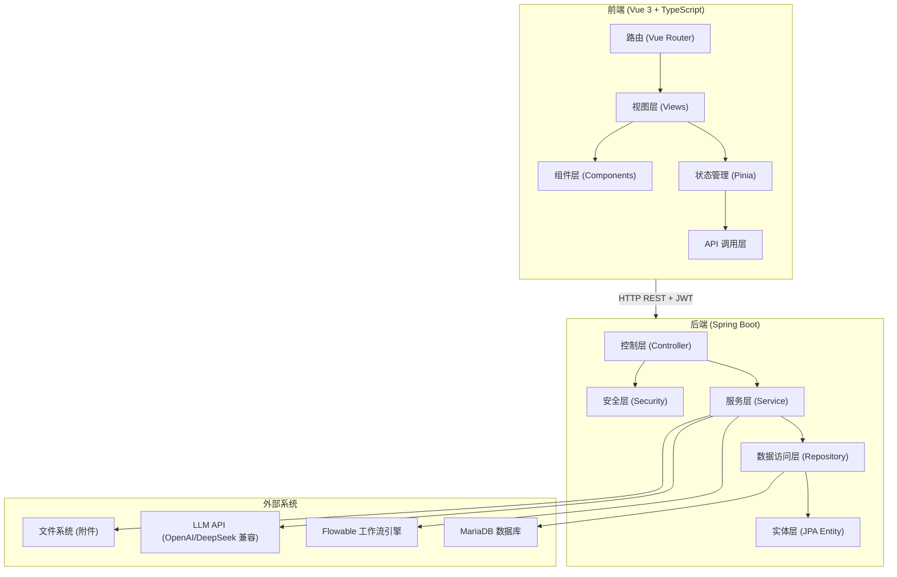

# 系统架构设计文档

> 本文档基于实际代码实现反向推导，描述系统的技术架构和设计模式。

## 1. 技术栈

| 层次 | 技术 | 版本 |
|------|------|------|
| 后端框架 | Spring Boot | 3.5.10 |
| 工作流引擎 | Flowable | 7.0.0.M2 |
| 数据库 | MariaDB + H2 (测试) | - |
| ORM | Spring Data JPA (Hibernate) | - |
| 安全 | Spring Security + JWT (jjwt 0.12.6) | - |
| 前端框架 | Vue 3 + TypeScript | - |
| 构建工具 | Vite | - |
| 状态管理 | Pinia | - |
| AI SDK | OpenAI 兼容 API (可切换 DeepSeek) | - |
| 文件处理 | Apache POI (Excel) + Commons CSV | 5.3.0 / 1.11.0 |
| 密码加密 | BCrypt (Spring Security Crypto) | - |
| 二因素认证 | TOTP (commons-codec) | - |

## 2. 系统分层架构



## 3. 后端包结构

```
com.flowablecollab.approval_system
├── ApprovalSystemApplication.java    # Spring Boot 入口
├── config/
│   ├── FlowableConfig.java           # Flowable 引擎配置
│   └── SecurityConfig.java           # Spring Security + JWT 配置
├── controller/
│   ├── AuthController.java           # 认证相关 API
│   ├── WorkflowController.java       # 审批流程 API
│   ├── RequestController.java        # 申请单查询 API
│   ├── FormController.java           # 表单 API
│   ├── FormCommandAiController.java  # AI 表单解析 API
│   ├── DepartmentController.java     # 部门管理 API
│   ├── PositionController.java       # 岗位管理 API
│   ├── RbacController.java           # 角色权限管理 API
│   ├── AdminUserController.java      # 用户管理 API
│   ├── RequestTemplateController.java # 申请模板 API
│   ├── UserDirectoryController.java  # 用户目录查询 API
│   ├── LoginLogController.java       # 登录日志 API
│   ├── GlobalExceptionHandler.java   # 全局异常处理
│   ├── HomeController.java           # 首页/静态资源
│   └── admin/
│       ├── AdminSettingsController.java          # 系统设置管理
│       ├── FormAdminController.java              # 表单管理
│       └── workflow/
│           ├── WorkflowDefinitionAdminController.java     # 流程定义管理
│           ├── WorkflowDefinitionVersionAdminController.java # 流程版本管理
│           ├── WorkflowNodeConfigAdminController.java     # 节点配置管理
│           ├── WorkflowPublishAdminController.java        # 流程发布
│           └── RequestTemplateAdminController.java        # 模板管理
├── entity/
│   ├── BizRequest.java               # 申请单实体
│   ├── BizRequestTask.java           # 审批任务实体
│   ├── BizRequestLog.java            # 操作日志实体
│   ├── AiSuggestionRecord.java       # AI 建议记录实体
│   ├── form/                          # 动态表单实体
│   │   ├── FormDefinition.java
│   │   ├── FormVersion.java
│   │   ├── FormField.java
│   │   ├── FormInstance.java
│   │   └── FormAttachment.java
│   ├── rbac/                          # RBAC 实体
│   │   ├── SysUser.java
│   │   ├── SysRole.java
│   │   ├── SysDept.java
│   │   ├── SysPost.java
│   │   ├── SysUserRole.java
│   │   ├── SysUserPost.java
│   │   ├── SysRoleDataScope.java
│   │   ├── SysLoginLog.java
│   │   ├── SysUserImportJob.java
│   │   └── SysUserImportJobItem.java
│   ├── workflow/                      # 工作流管理实体
│   │   ├── WorkflowDefinition.java
│   │   ├── WorkflowDefinitionVersion.java
│   │   ├── WorkflowNodeConfig.java
│   │   ├── WorkflowPublishLog.java
│   │   └── RequestTemplate.java
│   └── settings/
│       └── SystemSetting.java        # 系统设置实体
├── repository/                       # Spring Data JPA 仓库接口
├── service/
│   ├── WorkflowService.java          # 审批流程核心服务
│   ├── FormService.java              # 表单服务
│   ├── AuthService.java              # 认证服务
│   ├── RbacService.java              # 权限管理服务
│   ├── AdminUserService.java         # 用户管理服务
│   ├── DepartmentService.java        # 部门服务
│   ├── PositionService.java          # 岗位服务
│   ├── LoginLogService.java          # 登录日志服务
│   ├── TaskAiSuggestionService.java  # AI 建议缓存与持久化
│   ├── RequestApprovalResolverService.java    # 审批人自动解析
│   ├── RequestTemplateApprovalResolverService.java # 模板审批解析
│   ├── ai/
│   │   ├── LlmClient.java            # LLM 抽象接口
│   │   ├── OpenAiLlmClient.java      # OpenAI 兼容实现
│   │   ├── MockLlmClient.java        # Mock 实现
│   │   ├── ApprovalSuggestionService.java # 审批建议生成
│   │   └── FormCommandAiService.java # 自然语言表单解析
│   ├── form/
│   │   ├── FormManagementService.java # 表单 CRUD 管理
│   │   └── FormCatalogBootstrapService.java # 表单模板引导
│   ├── settings/
│   │   ├── SettingsCryptoService.java # 设置加密服务
│   │   └── AiProviderSettingsService.java # AI 配置服务
│   └── workflow/manage/
│       ├── WorkflowDefinitionService.java    # 流程定义服务
│       ├── WorkflowDefinitionVersionService.java # 流程版本服务
│       ├── WorkflowNodeConfigService.java    # 节点配置服务
│       ├── WorkflowPublishService.java       # 流程发布服务
│       ├── FlowableDeploymentService.java    # Flowable 部署服务
│       ├── WorkflowLaunchResolverService.java # 发起流程解析
│       ├── RequestTemplateService.java       # 模板服务
│       ├── RequestTemplateApprovalConfig.java # 审批配置
│       ├── WorkflowCatalogBootstrapService.java # 工作流引导
│       └── WorkflowManageDtos.java           # 管理 DTO
├── security/
│   ├── JwtService.java               # JWT 生成与校验
│   ├── JwtAuthenticationFilter.java  # JWT 认证过滤器
│   ├── AuthUserPrincipal.java        # 认证用户主体
│   ├── SecurityUtils.java            # 安全工具类
│   └── TotpService.java              # TOTP 服务
├── exception/                         # 自定义异常
│   ├── ForbiddenOperationException.java
│   ├── ResourceNotFoundException.java
│   ├── ResourceConflictException.java
│   └── WorkflowValidationException.java
└── listener/
    ├── CountersignTaskListener.java   # 会签任务监听器
    └── SingleApprovalTaskListener.java # 单人审批任务监听器
```

## 4. 核心架构设计

### 4.1 安全架构

```
请求 → JwtAuthenticationFilter → SecurityContext → @PreAuthorize → Controller
                ↓
        JwtService.parseAccessToken()
                ↓
        提取 userId, username, roles
                ↓
        AuthUserPrincipal (存储在 SecurityContext)
```

**认证流程：**
1. POST /api/auth/login → 验证用户名密码 → 返回 Access Token (120分钟)
2. 如开启 2FA → 返回 Challenge Token → POST /api/auth/login/2fa → 返回 Access Token
3. 后续请求携带 `Authorization: Bearer <token>` 头

**授权机制：**
- URL 级别：`SecurityConfig.java` 中按路径+角色匹配
- 方法级别：Controller 中通过 `SecurityUtils.hasAnyRole()` 手动校验
- 数据级别：`RbacService.getAccessibleDeptIds()` 基于角色数据范围过滤

### 4.2 工作流引擎集成

```
Controller → WorkflowService → Flowable RuntimeService/TaskService
                    ↓                       ↓
              biz_request 表         Flowable 内部表
              (业务数据)              (流程状态)
```

**事务一致性：** 业务操作与 Flowable 操作在同一 `@Transactional` 中，Flowable 与业务库共享数据源，保证事务一致性。

**BPMN 流程定义：**

系统内置 5 个 BPMN 流程文件：

| 流程文件 | processKey | 说明 |
|------|------|------|
| approval-single.bpmn20.xml | approvalSingle | 单人审批 |
| approval-countersign.bpmn20.xml | approvalCountersign | 并行会签 |
| approval-orsign.bpmn20.xml | approvalOrSign | 或签 |
| approval-sequential.bpmn20.xml | approvalSequential | 顺序审批 |
| approval-workflow.bpmn20.xml | approvalWorkflow | 通用会签（默认） |

### 4.3 AI 集成架构

```
┌─────────────────────────────────────────────┐
│               LlmClient (接口)                │
│  ┌─────────────────┐  ┌───────────────────┐  │
│  │ OpenAiLlmClient  │  │  MockLlmClient     │  │
│  │ (OpenAI/DeepSeek)│  │  (测试用 Mock)     │  │
│  └─────────────────┘  └───────────────────┘  │
└─────────────────────────────────────────────┘
         ↓                        ↓
  ApprovalSuggestionService   FormCommandAiService
  (审批建议生成)               (自然语言表单解析)
         ↓                        ↓
  TaskAiSuggestionService    FormCommandAiController
  (缓存 + 持久化)             (REST API)
```

**LLM 调用策略：**
- 审批建议：将表单数据、申请人统计、历史案例、风险规则发送给 LLM，获取审批建议
- 表单解析：LLM 优先，失败时回退到启发式正则解析器
- 模型可切换：通过系统设置动态切换 OpenAI/DeepSeek 等兼容模型
- 审计追踪：所有 AI 建议记录持久化到 `ai_suggestion_record` 表

### 4.4 动态表单架构

```
form_definition (1) ──→ (N) form_version (1) ──→ (N) form_field
                              │
                              ↓
                        form_instance (1:1) ──→ biz_request
                              │
                              ↓
                        form_attachment
```

**版本绑定策略：**
- 流程定义版本 1:1 绑定表单版本
- 已运行的流程实例保持表单版本不变
- 新发起的流程使用流程当前版本绑定的表单版本

### 4.5 前端路由架构

```
/login          → 登录页
/bootstrap      → 系统引导页（首次初始化管理员）
/user/*         → UserLayout（普通用户布局）
  /user/home    → 首页
  /user/start   → 发起申请
  /user/tasks   → 我的待办
  /user/requests → 我的申请
  /user/approved → 我审批的
  /user/profile → 个人中心
/admin/*        → AdminLayout（管理员布局）
  /admin/home           → 管理首页
  /admin/forms          → 表单管理（DESIGNER+）
  /admin/users          → 用户管理（SYS_ADMIN）
  /admin/roles          → 角色管理（SYS_ADMIN）
  /admin/departments    → 部门管理（SYS_ADMIN）
  /admin/positions      → 岗位管理（SYS_ADMIN）
  /admin/workflows      → 工作流管理（SYS_ADMIN）
  /admin/workflows/:id  → 版本详情（SYS_ADMIN）
  /admin/request-templates → 申请模板（ADMIN+）
  /admin/settings       → 系统设置（SYS_ADMIN）
```

## 5. 关键技术决策

| 决策点 | 选择 | 理由 |
|------|------|------|
| 工作流引擎 | Flowable 7.0.0 | 轻量级、Spring Boot 集成好、BPMN 2.0 标准 |
| 认证方案 | JWT 无状态 | 适合前后端分离、无需服务端 Session |
| 前后端分离 | Vue 3 SPA | 独立部署、开发效率高 |
| API 风格 | RESTful | 标准化、易理解 |
| ORM | JPA + Hibernate ddl-auto:update | 开发阶段快速迭代 |
| 数据源共享 | 业务表 + Flowable 表同库 | 保证事务一致性 |
| AI 模型层 | 接口抽象 + 多实现 | 不绑定特定供应商 |
| 表单版本化 | 不可变版本 | 运行中流程不受表单变更影响 |

## 6. 部署架构（建议）

```
┌──────────────────────────────────────────────────────────┐
│                      Nginx (反向代理)                      │
│                  静态文件 + API 代理                       │
└──────────┬───────────────────────────────┬───────────────┘
           │                               │
    ┌──────▼──────┐                 ┌──────▼──────┐
    │ Vue 3 前端   │                 │ Spring Boot │
    │ (静态资源)   │                 │ (API 服务)   │
    └─────────────┘                 └──────┬───────┘
                                          │
                                    ┌─────▼─────┐
                                    │  MariaDB   │
                                    │ (业务+流程) │
                                    └───────────┘
```
