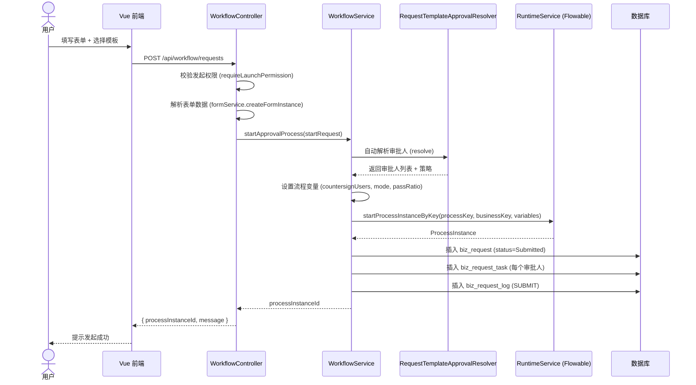
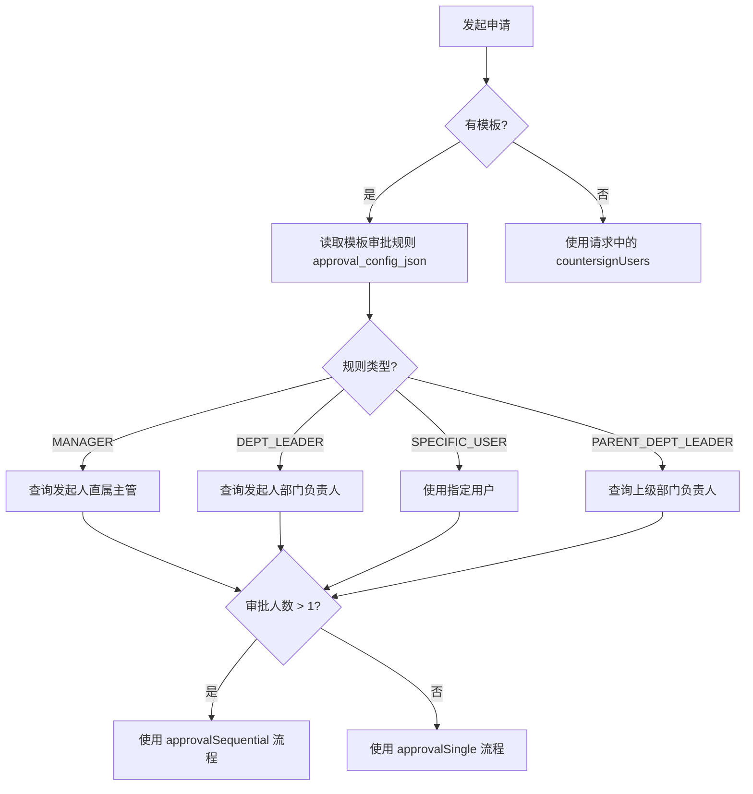
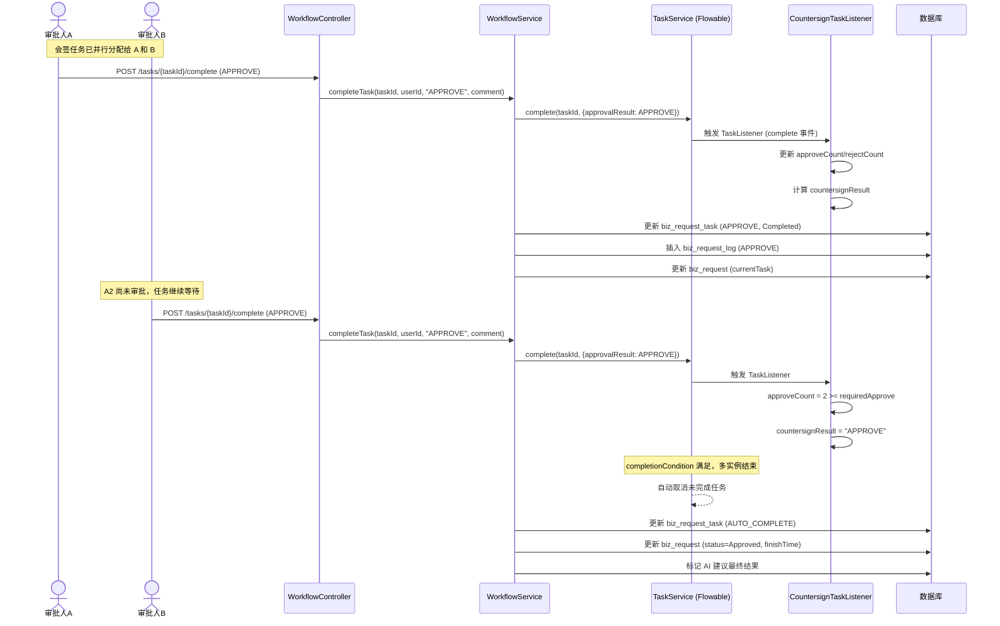
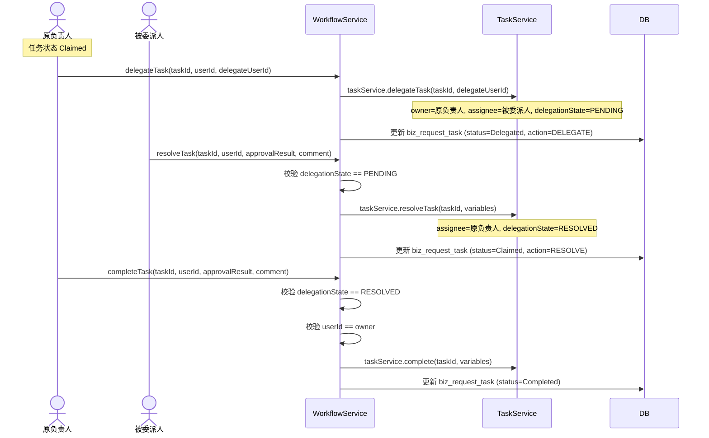
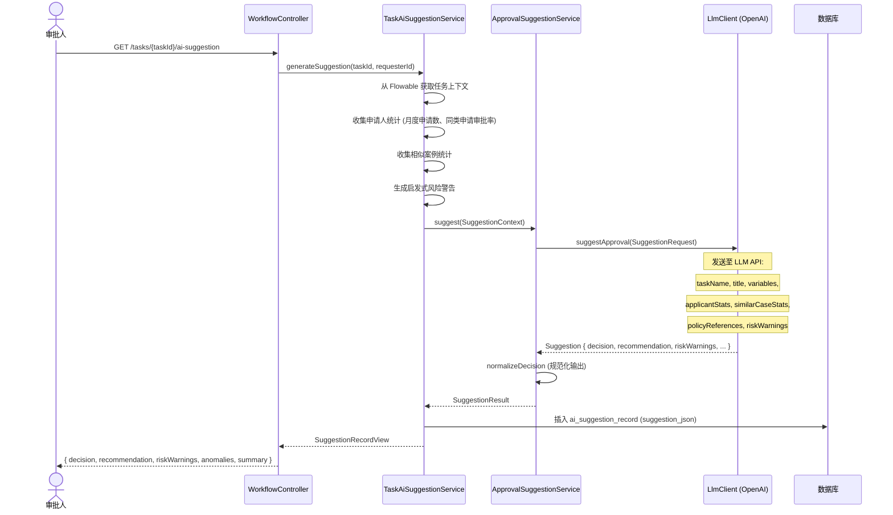
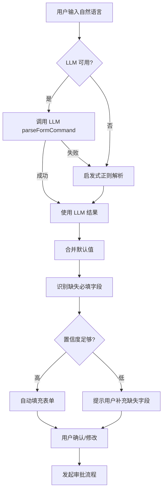
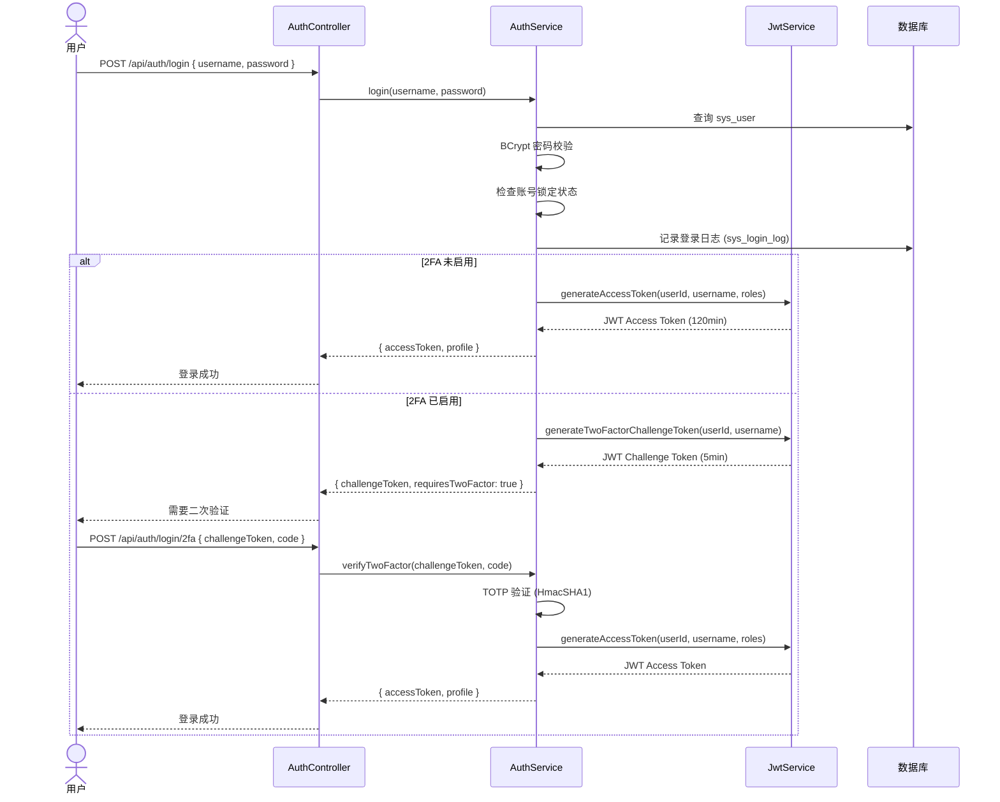
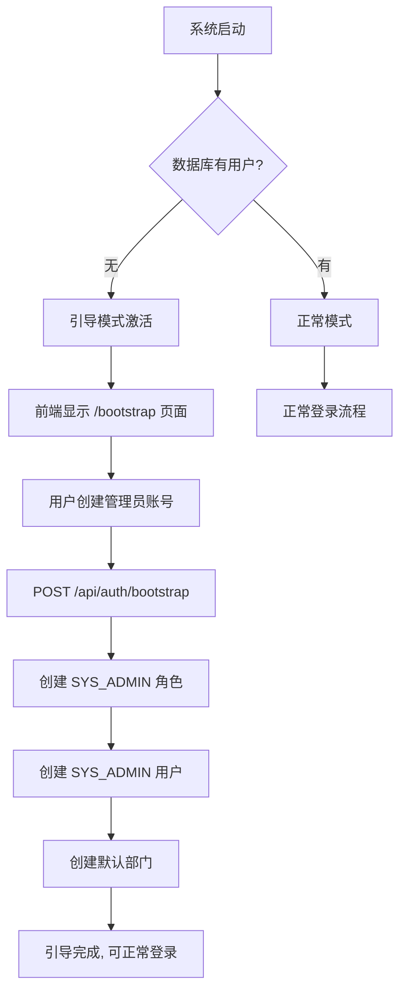

# 核心模块设计与时序图

> 基于实际代码实现，对核心功能模块进行详细设计说明。

## 1. 审批流程发起模块

### 1.1 流程发起时序



### 1.2 审批人自动解析



## 2. 审批执行模块

### 2.1 会签审批时序（并行多实例）



### 2.2 委派与时序



### 2.3 回退流程

```mermaid
sequenceDiagram
    actor U as 审批人
    participant WC as WorkflowController
    participant WS as WorkflowService
    participant RS as RuntimeService
    participant DB as 数据库

    U->>WC: POST /tasks/{taskId}/return/previous
    WC->>WS: returnToPrevious(taskId, userId, comment)

    WS->>WS: 从历史活动查询上一个 UserTask activityId
    WS->>RS: setVariable(approveCount=0, rejectCount=0, countersignResult=PENDING)
    WS->>RS: createChangeActivityStateBuilder()
             .moveExecutionToActivityId(executionId, previousActivityId)
             .changeState()

    WS->>DB: 更新 biz_request_task (status=Returned, action=RETURN)
    WS->>DB: 插入 biz_request_log (RETURN)
    WS->>DB: 更新 biz_request (status=Returned)
    WS->>WS: refreshCurrentTask (创建新的待办任务)

    WC-->>U: 回退成功
```

## 3. AI 审批建议模块

### 3.1 建议生成流程



### 3.2 AI 建议输入数据结构

LLM 收到的每条审批建议请求包含以下维度的数据：

| 数据维度 | 内容 | 来源 |
|------|------|------|
| 任务上下文 | 任务名称、申请标题、表单变量 | Flowable 流程变量 |
| 申请人画像 | 月度申请总数、同类申请数、月度总金额、平均金额 | 历史数据统计 |
| 历史参考 | 相似案例样本数、通过率、拒绝率、平均处理时间 | 历史数据统计 |
| 规则参考 | 策略引用列表 | 系统配置 |
| 风险提示 | 启发式风险警告列表、异常检测列表 | 规则引擎 |

### 3.3 AI 建议输出结构

```json
{
  "decision": "APPROVE",
  "recommendation": "该申请金额在预算范围内，申请人在过去3个月有良好记录...",
  "summary": "建议通过，本次差旅申请合规",
  "riskWarnings": ["预算使用率已达 85%"],
  "anomalies": [],
  "supplementaryInfo": ["同类申请平均审批时间 2.3 小时"],
  "approvalComment": "同意该差旅申请，预算充足，行程合理。",
  "suggestedFormUpdates": {}
}
```

## 4. 自然语言表单解析模块

### 4.1 解析流程



### 4.2 启发式解析策略

| 字段类型 | 解析方法 |
|------|------|
| number | 正则匹配数字 `-?\d+(\.\d+)?`，排除日期中的数字 |
| 金额字段 | 关键词匹配（金额/预算/费用/报销）+ 货币符号（¥/$）+ 单位（元/块） |
| 日期字段 | ISO 日期 `YYYY-MM-DD`、中文日期 `YYYY年M月D日`、DateTime `YYYY-MM-DD HH:mm:ss` |
| 天数/时长 | 中文数字（一/二/.../十）+ "天"、日期区间差值 |
| select | 选项 label/value 关键词匹配 |
| 字符串 | 字段别名（label/key）后紧跟的值 |

## 5. 安全模块

### 5.1 JWT 认证流程



### 5.2 请求认证过滤器

```
HTTP Request
    ↓
JwtAuthenticationFilter.doFilterInternal()
    ↓
提取 Authorization: Bearer <token>
    ↓
JwtService.parseAccessToken(token) → Claims
    ↓
提取 userId, username, roles from Claims
    ↓
创建 AuthUserPrincipal → UsernamePasswordAuthenticationToken
    ↓
存入 SecurityContextHolder
    ↓
SecurityFilterChain 继续 → Controller
```

## 6. 系统初始化引导模块



## 7. 设计模式总结

| 设计模式 | 应用位置 | 说明 |
|------|------|------|
| 策略模式 | `LlmClient` 接口 + `OpenAiLlmClient`/`MockLlmClient` | LLM 提供商可切换 |
| 模板方法 | `WorkflowService` 中统一的审批操作流程 | claim→complete→log |
| 监听器模式 | `CountersignTaskListener` / `SingleApprovalTaskListener` | Flowable TaskListener 回调 |
| 仓储模式 | Spring Data JPA `Repository` 接口 | 数据访问抽象 |
| 过滤器链 | Spring Security Filter Chain + `JwtAuthenticationFilter` | 请求认证 |
| DTO 模式 | Controller 中定义的 `StartProcessRequest`/`TaskInfo` 等静态内部类 | 数据传输 |
| 工厂模式 | `FormCatalogBootstrapService` / `WorkflowCatalogBootstrapService` | 系统初始化 |
